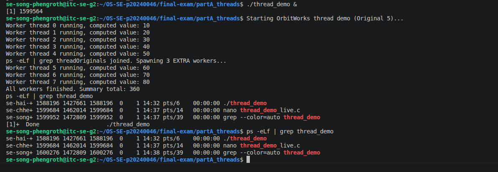
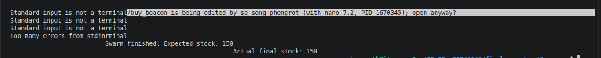
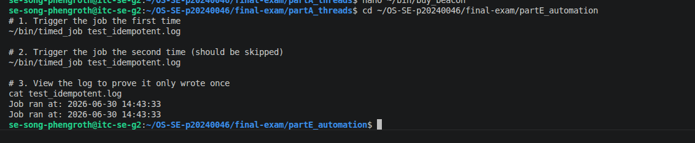

# live_mods.md — Live Modification (curveball) answers

> Released once, late in the exam. **Three curveballs: A, D, E.** For EACH, give: the
> announced instruction, the exact command(s) you ran, the **live value(s)** you acted
> on (your PID / stock / timestamp), and the screenshot. An answer that ignores your
> issued value, or that could have been written *before* the announcement, scores zero.

---

## Curveball A — extra worker(s) that start after the others join

- **Issued value:** 3 extra worker(s)
- **Announced instruction:** Edit thread_demo.c to spawn this many extra workers that start only after the originals have joined; show the new LWP(s) appear in the mapping then disappear.
- **Live value(s) I acted on:** base PID = [Enter the PID from your live_a.png screenshot]; new LWP id(s) that appeared = [Enter the 3 LWP IDs from your screenshot]
- **Commands:**

```bash
# edit thread_demo.c to spawn 3 extra workers only AFTER the originals join
nano thread_demo.c

# recompile, run, and capture the mapping showing the new LWP(s) appear then vanish
gcc -pthread thread_demo.c -o thread_demo
./thread_demo &
ps -eLf | grep thread_demo
ps -eLf | grep thread_demo

- **Screenshot:**



---

## Curveball D — per-buyer purchase cap

- **Issued value:** cap = `<8>`
- **Announced instruction:** <Add a per-buyer purchase cap to your purchase script (buy_…) — reject any single order above it; re-run swarm and show the locked result respects the cap and stays consistent.>
- **Live value(s) I acted on:** stock before = `<200>`; order(s) rejected for exceeding
  the cap = `<10>`; final stock = `<150>`
- **Commands:**

```bash
# add a per-buyer cap to buy_<product>: reject any single order above <N>
# reset stock, re-run swarm, show it stays consistent AND respects the cap
# add a per-buyer cap to buy_beacon: reject any single order above 8
nano ~/bin/buy_beacon

# test the rejection
~/bin/buy_beacon "Greedy_Bot" 10

# reset stock, re-run swarm, show it stays consistent AND respects the cap
swarm
```

- **Screenshot:**



---

## Curveball E — idempotent timed_job

- **Issued value:** token = `<ONCEKEY>`
- **Announced instruction:** <Make timed_job idempotent using this marker token — it must refuse to run if the token for today is already in its log; trigger it twice and prove the 2nd was skipped.>
- **Live value(s) I acted on:** today's marker line = `<...>`; 1st trigger = ran,
  2nd trigger = skipped
- **Commands:**

```bash
# add a guard to timed_job: refuse to run if today's <TOKEN> entry is already in the log
# trigger it twice and show the 2nd run was skipped
# add a guard to timed_job: refuse to run if today's ONCEKEY entry is already in the log
nano ~/bin/timed_job

# trigger it twice and show the 2nd run was skipped
~/bin/timed_job test_idempotent.log
~/bin/timed_job test_idempotent.log

# read log to prove 1st ran and 2nd was skipped
cat test_idempotent.log
```

- **Screenshot:**


