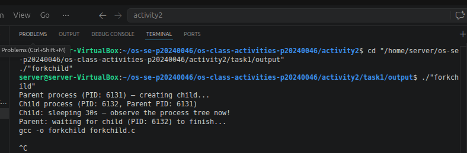
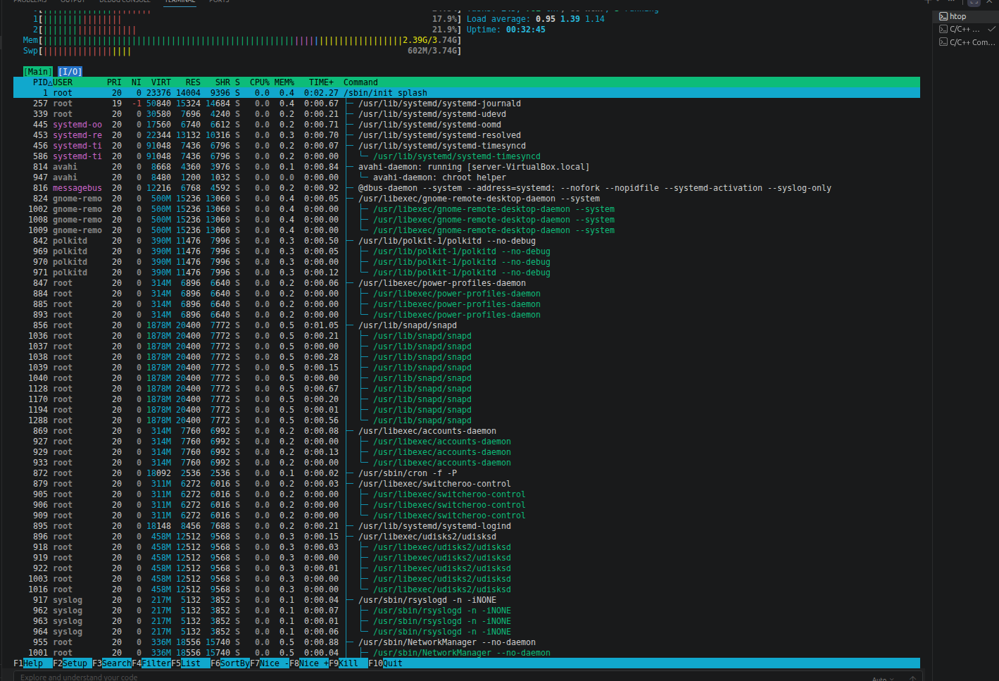
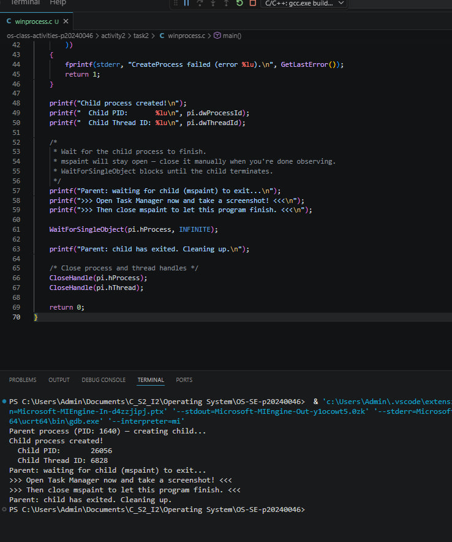
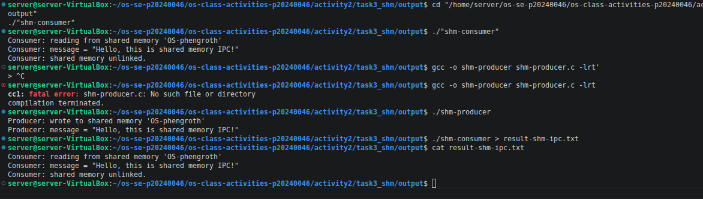
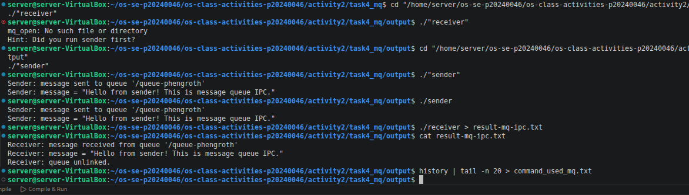

Class Activity 2 — Processes & Inter-Process Communication

    Student Name: Song Phengroth
    Student ID: P20240046
    Date: 3/April/2026

## Task 1: Process Creation on Linux (fork + exec)

### Compilation & Execution

Screenshot of compiling and running `forkchild.c`:



### Process Tree

Screenshot of the parent-child process tree (using `ps --forest`, `pstree`, or `htop` tree view):



### Output

```
[Paste the content of result_forkchild.txt here]
Parent process (PID: 7608) — creating child...
Parent: waiting for child (PID: 7609) to finish...
Child process (PID: 7609, Parent PID: 7608)
Child: sleeping 30s — observe the process tree now!
tree
```

Questions

    What does fork() return to the parent? What does it return to the child?

fork() returns the child’s PID to the parent process, and 0 to the child process. If it fails, it returns -1 to the parent.

    What happens if you remove the waitpid() call? Why might the output look different?

Without waitpid(), the parent does not wait for the child to finish. This can cause:

Output to appear out of order The child process to become a zombie process temporarily The parent may terminate before the child completes

    What does execlp() do? Why don't we see "execlp failed" when it succeeds?

execlp() replaces the current process image with a new program (e.g., ls). When it succeeds, it does not return to the original code, so the "execlp failed" message is never executed. That message only appears if the function fails.

    Draw the process tree for your program (parent → child). Include PIDs from your output.

Parent Process (PID: 1234) └── Child Process (PID: 1235) → exec("ls")

    Which command did you use to view the process tree (ps --forest, pstree, or htop)? What information does each column show?

I used ps --forest.

Columns typically show:

PID: Process ID PPID: Parent Process ID TTY: Terminal associated with the process STAT: Process state (running, sleeping, etc.) CMD: Command being executed The --forest option visually shows the parent-child hierarchy
Task 2: Process Creation on Windows
Compilation & Execution

Screenshot of compiling and running winprocess.c:

## Task 2: Process Creation on Windows

### Compilation & Execution

Screenshot of compiling and running `winprocess.c`:



### Task Manager Screenshots

Screenshot showing process tree in the **Processes** tab (mspaint nested under your program):


Screenshot showing PID and Parent PID in the **Details** tab:


Questions

    What is the key difference between how Linux creates a process (fork + exec) and how Windows does it (CreateProcess)?

Linux uses a two-step process:

fork() duplicates the current process exec() replaces it with a new program

Windows uses CreateProcess(), which does both in one step—it directly creates and runs a new process.

    What does WaitForSingleObject() do? What is its Linux equivalent?

WaitForSingleObject() pauses execution until the specified process finishes. The Linux equivalent is wait() or waitpid().

    Why do we need to call CloseHandle() at the end? What happens if we don't?

CloseHandle() releases system resources associated with the process or thread. If not called:

It causes resource leaks Can eventually reduce system performance or exhaust available handles

    In Task Manager, what was the PID of your parent program and the PID of mspaint? Do they match your program's output?

Parent PID: 15252 Child PID (mspaint): 16656 Yes, they match the program output and Task Manager values.

    Compare the Processes tab (tree view) and the Details tab (PID/PPID columns). Which view makes it easier to understand the parent-child relationship? Why?

The Processes tab (tree view) is easier to understand because it visually shows parent-child relationships. The Details tab provides precise technical data (PID, PPID) but requires manual interpretation.
---

## Task 3: Shared Memory IPC

### Compilation & Execution

Screenshot of compiling and running `shm-producer` and `shm-consumer`:



### Output

```
[Paste the content of result-shm-ipc.txt here]
Consumer: reading from shared memory 'OS-phengroth'
Consumer: message = "Hello, this is shared memory IPC!"
Consumer: shared memory unlinked.
```

Questions

    What does shm_open() do? How is it different from open()?

shm_open() creates or opens a shared memory object for IPC. Unlike open(), which works with files on disk, shm_open() operates in memory (RAM).

    What does mmap() do? Why is shared memory faster than other IPC methods?

mmap() maps the shared memory into the process's address space. Shared memory is faster because:

No copying between processes Direct memory access No kernel overhead after setup

    Why must the shared memory name match between producer and consumer?

Both processes must refer to the same memory region. If names differ, they will access different memory objects, breaking communication.

    What does shm_unlink() do? What would happen if the consumer didn't call it?

shm_unlink() removes the shared memory object. If not called:

The memory persists in the system Leads to memory leaks

    If the consumer runs before the producer, what happens? Try it and describe the error.

The consumer will fail with an error like:

shm_open failed: No such file or directory

Because the shared memory has not been created yet.

## Task 4: Message Queue IPC

### Compilation & Execution

Screenshot of compiling and running `sender` and `receiver`:



### Output

```
[Paste the content of result-mq-ipc.txt here]
Receiver: message received from queue '/queue-phengroth'
Receiver: message = "Hello from sender! This is message queue IPC."
Receiver: queue unlinked
```

Questions

    How is a message queue different from shared memory? When would you use one over the other?

Message queues:

Send discrete messages Easier synchronization

Shared memory:

Faster (direct access) Requires manual synchronization

Use message queues for simplicity, shared memory for performance.

    Why does the queue name in common.h need to start with /?

POSIX message queues require names to start with / to distinguish them from regular file paths.

    What does mq_unlink() do? What happens if neither the sender nor receiver calls it?

It removes the message queue from the system. If not called:

The queue remains in the system Can cause resource leaks or conflicts

    What happens if you run the receiver before the sender?

The receiver will:

Either block and wait for messages Or fail if the queue does not exist (depending on flags)

    Can multiple senders send to the same queue? Can multiple receivers read from the same queue?

Yes:

Multiple senders can send to the same queue Multiple receivers can read from it

The system manages message ordering and synchronization.
Reflection

What did you learn from this activity? What was the most interesting difference between Linux and Windows process creation? Which IPC method do you prefer and why?

This activity helped me understand how processes are created and managed differently in Linux and Windows. The most interesting difference is that Linux separates process creation (fork) and execution (exec), while Windows combines both into a single function (CreateProcess).

I also learned how inter-process communication works using shared memory and message queues. Shared memory is very fast but requires careful synchronization, while message queues are easier to use but slightly slower.

Personally, I prefer message queues because they are simpler and safer to implement, especially when synchronization is important.