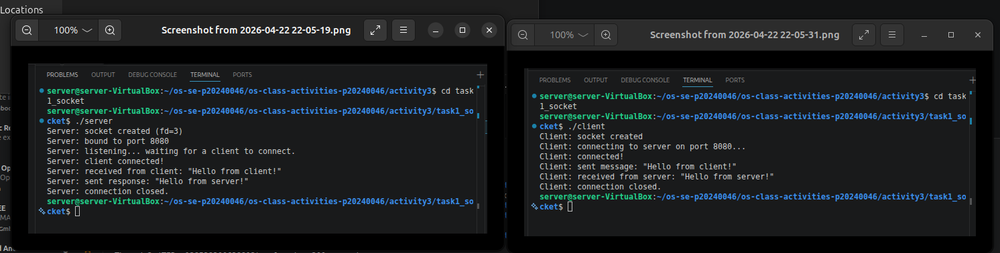
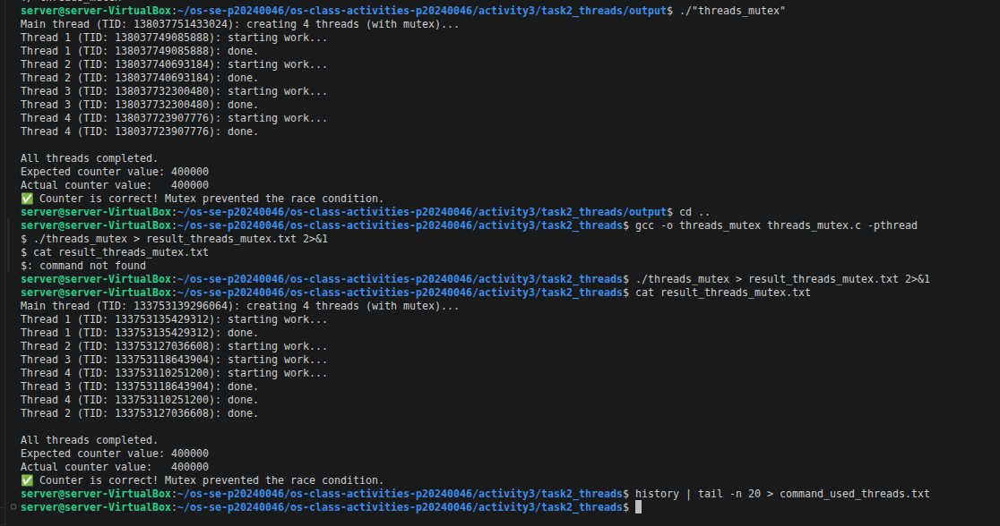
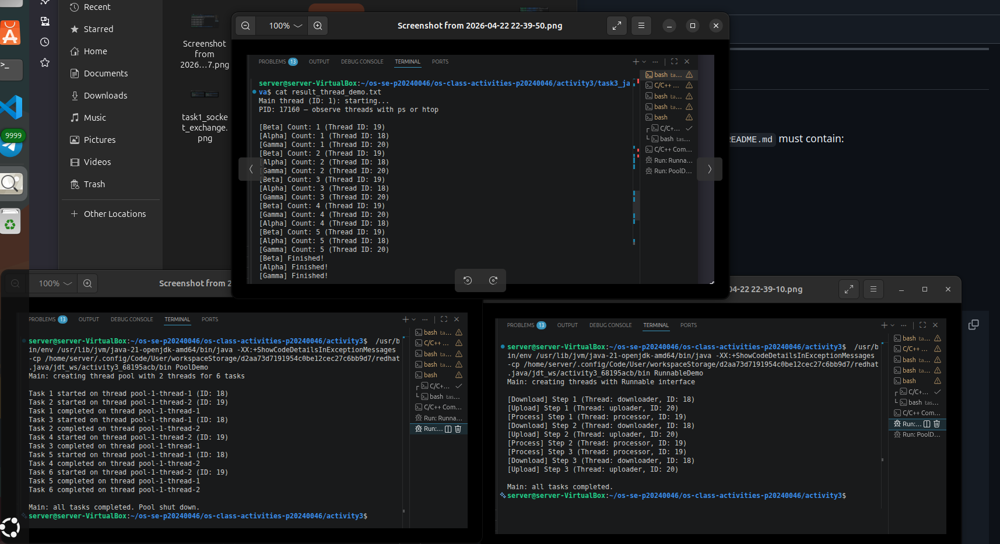
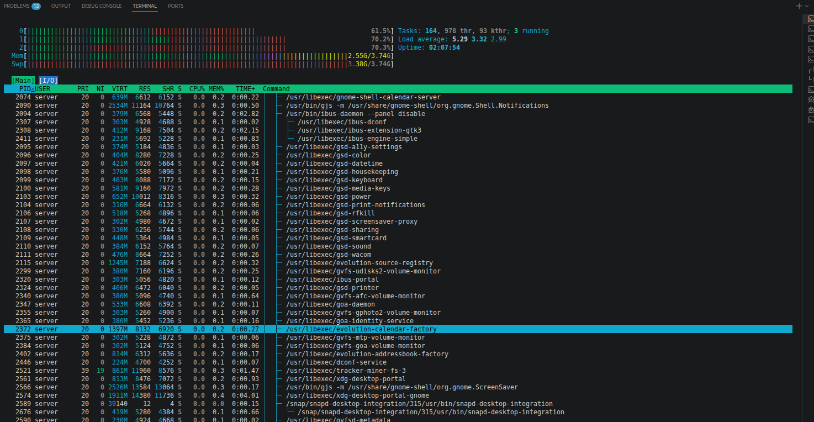

# Class Activity 3 — Socket Communication & Multithreading

- **Student Name:** Song Phengroth
- **Student ID:** p20240046
- **Date:** 23/04/2026

---

## Task 1: TCP Socket Communication (C)

### Compilation & Execution

### Answers

1. **Role of `bind()` / Why client doesn't call it:**
   > bind() is used to assign a socket to a specific IP address and port number on the local machine. The server uses bind() because it must listen on a known port so clients know where to connect. The client usually does not call bind() because the operating system automatically chooses an available local port when the client calls connect().

2. **What `accept()` returns:**
   > accept() returns a new socket descriptor for the established connection with a client. The original listening socket stays open to keep accepting more incoming connections, while the new socket is used for communication with that specific client.

3. **Starting client before server:**
   > If the client starts before the server, the connection will usually fail because no server is listening on the target port yet. In that case, the client may show an error such as “connection refused.”

4. **What `htons()` does:**
   > htons() means “host to network short.” It converts a 16-bit number, such as a port number, from the host’s byte order into network byte order, which is big-endian. This ensures data is interpreted correctly across different systems.

5. **Socket call sequence diagram:**
   > Server: socket() -> bind() -> listen() -> accept() -> recv()/send() -> close() Client: socket() -> connect() -> send()/recv() -> close()

---

## Task 2: POSIX Threads (C)

### Output — Without Mutex (Race Condition)

### Output — With Mutex (Correct)

_(Include in the same screenshot or a separate one)_

### Answers

1. **What is a race condition?**
   > A race condition happens when two or more threads access and modify shared data at the same time without proper synchronization. Because their execution order is unpredictable, the final result may be wrong or inconsistent.

2. **What does `pthread_mutex_lock()` do?**
   > pthread_mutex_lock() locks a mutex so only one thread can enter the critical section at a time. This prevents other threads from changing shared data until the mutex is unlocked.

3. **Removing `pthread_join()`:**
   > If pthread_join() is removed, the main thread may finish and exit before the worker threads complete their work. As a result, some threads may not finish properly, and the output may be incomplete or inconsistent.

4. **Thread vs Process:**
   > A process is an independent program with its own memory space and resources. A thread is a smaller unit of execution inside a process, and threads in the same process share memory and resources. Threads are lighter and faster to create than processes, but they require careful synchronization.

---

## Task 3: Java Multithreading

### ThreadDemo Output

### RunnableDemo Output

_(Include output or screenshot)_

### PoolDemo Output

_(Include output or screenshot)_

### Answers

1. **Thread vs Runnable:**
   > Extending Thread means creating a class that directly becomes a thread. Implementing Runnable means defining the task separately and passing it to a Thread object. Runnable is usually preferred because it is more flexible and allows the class to extend another class if needed.

2. **Pool size limiting concurrency:**
   > The pool size limits how many threads can run tasks at the same time. For example, if the pool size is 3, only 3 tasks can execute concurrently, while the rest wait in a queue until a thread becomes available.

3. **thread.join() in Java:**
   > thread.join() makes the current thread wait until the specified thread finishes execution. It is used when one thread must complete before the program continues.

4. **ExecutorService advantages:**
   > ExecutorService makes thread management easier by reusing threads, reducing creation overhead, and handling task scheduling automatically. It improves performance, makes code cleaner, and is better for managing multiple tasks than creating threads manually.

---

## Task 4: Observing Threads

### Linux — `ps -eLf` Output

ps -eLf | grep threads_observe
server     23800    9583   23800  0    5 23:29 pts/0    00:00:00 ./threads_observe
server     23800    9583   23802  0    5 23:29 pts/0    00:00:00 ./threads_observe
server     23800    9583   23803  0    5 23:29 pts/0    00:00:00 ./threads_observe
server     23800    9583   23804  0    5 23:29 pts/0    00:00:00 ./threads_observe
server     23800    9583   23805  0    5 23:29 pts/0    00:00:00 ./threads_observe
server     23849   20836   23849  0    1 23:30 pts/9    00:00:00 grep --color=auto threads_observe

### Linux — htop Thread View

### Answers

1. **LWP column meaning:**
   > LWP stands for Light Weight Process. In Linux, it represents an individual thread within a process. Each thread has its own LWP ID.

2. **/proc/PID/task/ count:**
   > The number of entries inside /proc/PID/task/ shows how many threads belong to that process. Each subdirectory represents one thread.

3. **Extra Java threads:**
   > Java programs often create extra threads automatically for tasks such as garbage collection, just-in-time compilation, signal handling, reference processing, and other JVM internal services. That is why a Java program may show more threads than the ones created directly in the code.

4. **Linux vs Windows thread viewing:**
   > In Linux, thread details can be viewed using commands like ps -eLf, top -H, htop, or by checking /proc/PID/task/. In Windows, threads can be observed through Task Manager, Resource Monitor, or Process Explorer. Linux usually provides more low-level thread details through command-line tools and the /proc filesystem.

---

## Reflection

> _What did you find most interesting about socket communication and threading? How does understanding threads at the OS level help you write better concurrent programs?_

What I found most interesting about socket communication is how two separate programs can communicate over a network using simple system calls like socket(), bind(), listen(), accept(), and connect(). It made me understand how client-server applications actually work behind the scenes. For threading, the most interesting part was seeing how multiple threads can run at the same time and improve performance, but also create problems like race conditions if shared data is not protected.

Understanding threads at the OS level helps me write better concurrent programs because I can see that threads are real execution units managed by the operating system, not just something abstract in code. This helps me understand why synchronization tools like mutexes and join() are necessary, how scheduling affects program behavior, and why poorly managed threads can cause bugs, crashes, or inconsistent output. By knowing how the OS handles threads, I can design programs that are safer, more efficient, and easier to debug.

