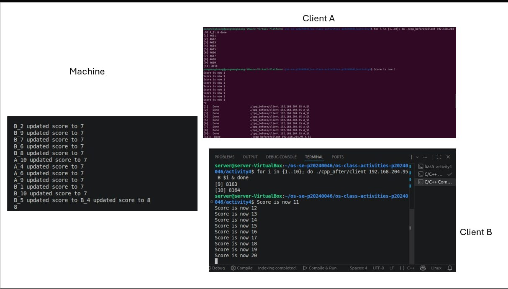
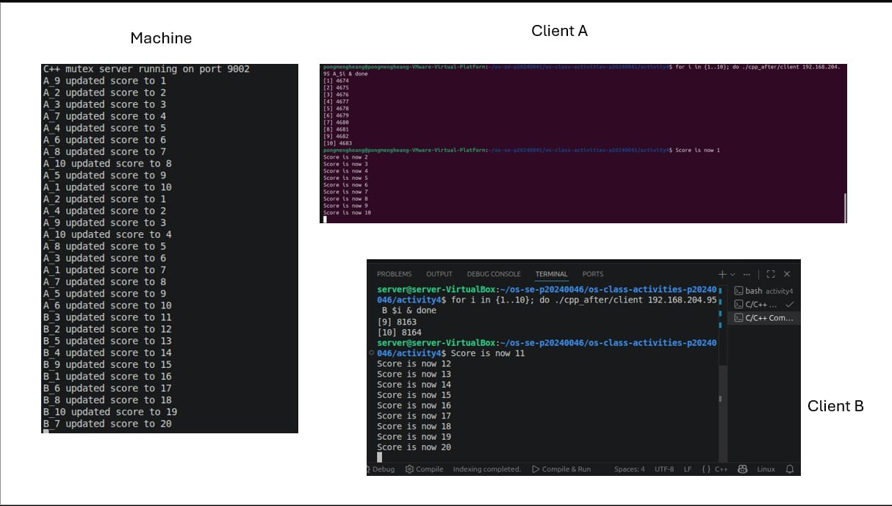
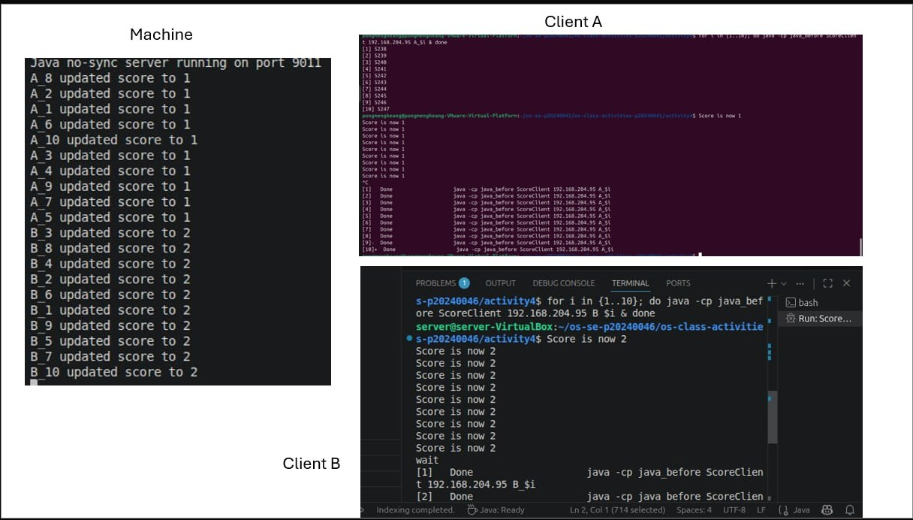
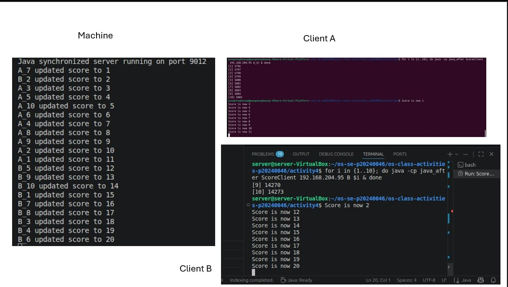

# Class Activity 4 — Shared File API

- **Student Name:** Song Pheangroth
- **Student ID:** P20240046
- **Partner Name:** Pong Mengheang
- **Partner Student ID:** P20240041
- **Partner Name:** Pi sereyVathanak
- **Partner Student ID:** P20240045
- **Server Machine Owner:** Pi sereyvathanak
- **Server IP Address:**192.168.204.95

---

## Task 1: C++ Before Mutex

- Expected score after 20 total client requests:
- Actual score: 8
- What happened: Race condition

---

## Task 2: C++ After Mutex

- Expected score after 20 total client requests:
- Actual score: 20
- What changed after adding mutex: it wait for first thread to finish and then start second thread

---

## Task 3: Java Before Synchronized

- Expected score after 20 total client requests:
- Actual score: 8
- What happened: Race condition

---

## Task 4: Java After Synchronized

- Expected score after 20 total client requests:
- Actual score: 20
- What changed after adding synchronized: it wait for one thread to finish and then start second thread

---

## Questions

1. Why should clients send requests to the server instead of writing the file directly?
If clients wrote to the file directly, they would overwrite each other's data constantly without any coordination, leading to severe data corruption. Routing requests through a single server establishes a centralized controller that can manage and sequence incoming data safely.
2. Why does the server still have a race condition before mutex or synchronized?
Even though there is only one server, it processes client requests concurrently using multiple threads. Without synchronization, two or more threads can read, modify, and write back the file data at the exact same time. This leads to an interleaving of operations (a race condition), where one thread's update accidentally overwrites another's before it can be saved.
3. In the C++ fixed version, what does `std::lock_guard<std::mutex>` protect?
It protects the critical section of the code—specifically, the block of code where the shared file is opened, read, updated, and written back. std::lock_guard automatically locks the mutex when it is created and unlocks it when it goes out of scope, ensuring only one thread can execute that code block at a time.
4. In the Java fixed version, what does `synchronized` protect?
The synchronized keyword protects the block of code or method from being executed by multiple threads simultaneously. It acquires an intrinsic lock (monitor) on a specified object, forcing other threads to wait in a queue until the thread currently inside the synchronized block finishes its execution.
5. Why is the final score expected to be 20 when Student A sends 10 requests and Student B sends 10 requests?
Because each request is meant to increment the score by 1. Since Student A sends 10 requests and Student B sends 10 requests, a perfectly synchronized system will process all 20 requests sequentially without dropping any updates, resulting in exactly:
10 + 10 = 20
6. What could happen if two separate servers update the same file at the same time?
A race condition would occur at the operating system or network file system level. Because mutexes and synchronization blocks only work within a single server process, two independent servers would have no awareness of each other's locks. They would conflict while trying to write to the same physical file, resulting in data corruption, partial writes, or locked-file errors.

---

## Reflection

_Compare the C++ and Java synchronization approaches. What did this activity teach you about protecting shared resources?_
This activity clearly demonstrated that multi-threading is a double-edged sword. While it allows a server to handle requests from multiple clients simultaneously, it introduces fatal data integrity issues if left unmanaged.

Protecting shared resources requires strict boundary control; any resource shared across threads (like a physical file or a global counter) must have a gatekeeper. Implementing synchronization mechanism—whether via C++ mutexes or Java synchronization—forces chaotic parallel operations into an orderly, sequential execution queue, transforming unpredictable actual outcomes (like a score of 8) into predictable, correct results (a score of 20).