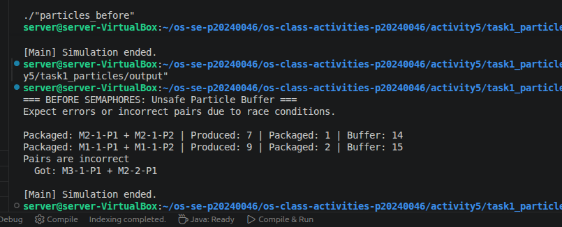
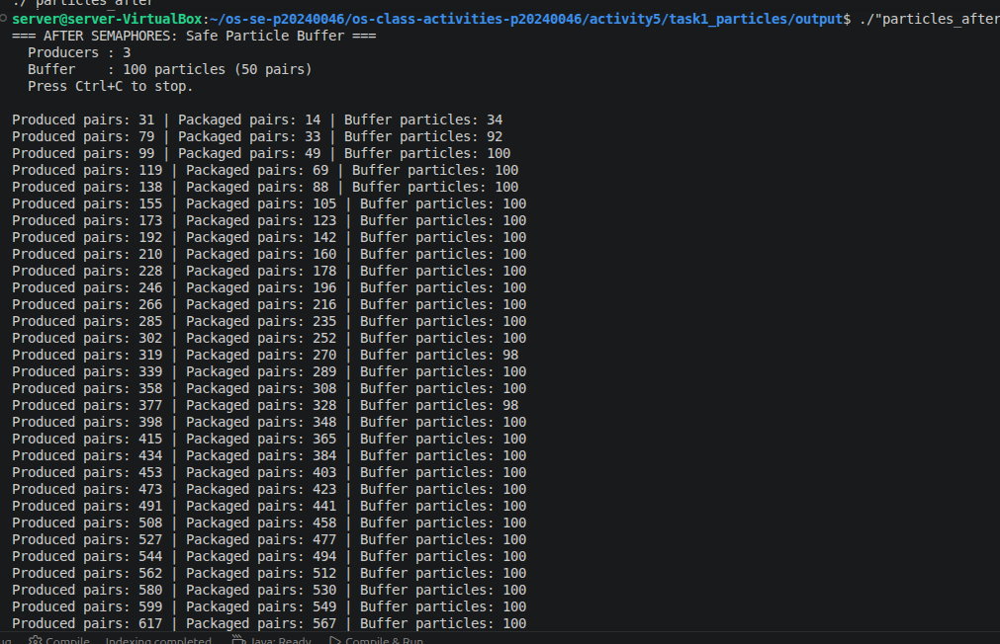
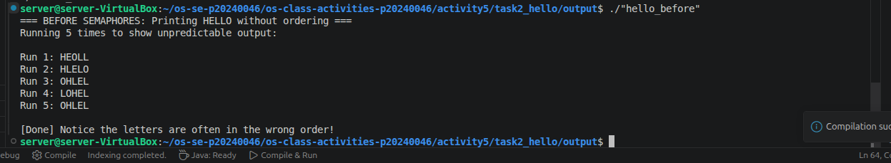
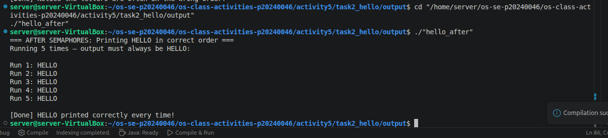

# Class Activity 5 - Semaphores

- **Student Name:** [Song Phengroth]
- **Student ID:** [p20240046]
- **Programming Language Used:** [ C++ ]

---

## Task 1A: Particle Pair Buffer Before Semaphores

- What error or incorrect behavior appeared:
- Why did this happen without semaphore protection:

---

## Task 1B: Particle Pair Buffer After Semaphores

- Number of producer machines:
- Buffer capacity:
- Semaphores used:
- Produced pair count shown in screenshot:
- Packaged pair count shown in screenshot:
- Did any error appear during normal operation?

---

## Task 2A: HELLO Before Semaphores

- Output before semaphore ordering:
- Why this output can be wrong or unpredictable:

---

## Task 2B: HELLO After Semaphores

- Processes or threads used:
- Semaphores used:
- Final output:

---

## Questions

1. In Task 1, why does a producer need to wait before adding a pair to the buffer?
->The buffer has a fixed capacity of 100 particles (50 pairs). If a producer adds particles
when the buffer is full, it violates the overflow rule and breaks the system. The producer
waits on empty_pairs (a counting semaphore initialised to 50) until a free pair-slot is
guaranteed. Without this wait, multiple producers could each see "one slot free", all
append simultaneously, and overflow the buffer.

2. In Task 1, why does the consumer need to wait before removing a pair from the buffer?
-> The consumer must wait on full_pairs (initially 0) to ensure at least one complete pair
is in the buffer before it tries to remove two particles. Without this wait, the consumer
could pop from an empty buffer (underflow), or grab a P1 that has not yet had its P2
appended — both of which are error conditions.

3. Which semaphore protects the critical section in your particle buffer program?
-> mutex (initialised to 1, a binary semaphore used as a mutual-exclusion lock). Every
read or write to buffer, produced_pairs, and packaged_pairs is wrapped between
mutex.acquire() and mutex.release(). This ensures only one thread modifies the shared
state at a time.

4. How does your program verify that `P1` and `P2` belong to the same pair?
-> Each particle is named with the format M<machineID>-<pairID>-P1 (or -P2).
The consumer strips the trailing -P1 / -P2 suffix using rsplit("-", 1)[0] and
compares the two resulting prefixes (e.g. M2-17). If they differ, the consumer prints
Pairs are incorrect and halts.

5. In Task 2, why can the program print letters in the wrong order without semaphores?
-> Threads are independent execution units scheduled by the OS. Without semaphores, all
three threads start and immediately compete to print. Whichever thread the scheduler
picks first gets the CPU — that could be Process 3 printing O before Process 1 has
even printed H. There is no mechanism to enforce a happens-before relationship between
the print operations.

6. Which semaphore or synchronization step forces `H` to print before `E`, `L`, `L`, and `O`?
-> start_h (initialised to 1) is acquired exclusively by Process 1 at the very beginning.
Only after Process 1 holds start_h does it print H and then E. No other process can
print until Process 1 signals after_e, which happens only after E is printed. So H
is structurally guaranteed to be the first letter output.

7. What could cause deadlock in either of your simulations?
-> Task 1 — wrong lock order: If a thread held mutex and then tried to acquire
empty_pairs or full_pairs (rather than acquiring the counting semaphore first),
and another thread held the counting semaphore while waiting for mutex, they would
deadlock. The fix (used in the implementation) is always to acquire the counting
semaphore before the mutex.
Task 1 — signal omission: If a producer crashed after acquiring empty_pairs but
before calling full_pairs.release(), the consumer would wait on full_pairs forever.
Task 2 — circular wait: If Process 2 waited on after_l1 before signalling it,
or if the semaphore chain were broken (e.g. after_e never released), subsequent
processes would block indefinitely — a classic linear deadlock.
---

## Reflection

_What did these simulations teach you about using semaphores for shared resources and ordered execution?_
-> In Task 1, seeing the before-version overflow the buffer or produce mismatched pairs
illustrated exactly why a mutex alone is not enough — you also need counting semaphores
to express "how much" resource is available. The three-semaphore design (empty_pairs,
full_pairs, mutex) cleanly separates those concerns.
In Task 2, the before-version reliably scrambled the letters every run, which was a
vivid reminder that concurrent threads have no implicit ordering. Chaining semaphores into
a signal-chain turned five unpredictable thread schedules into a deterministic sequence
with zero busy-waiting.