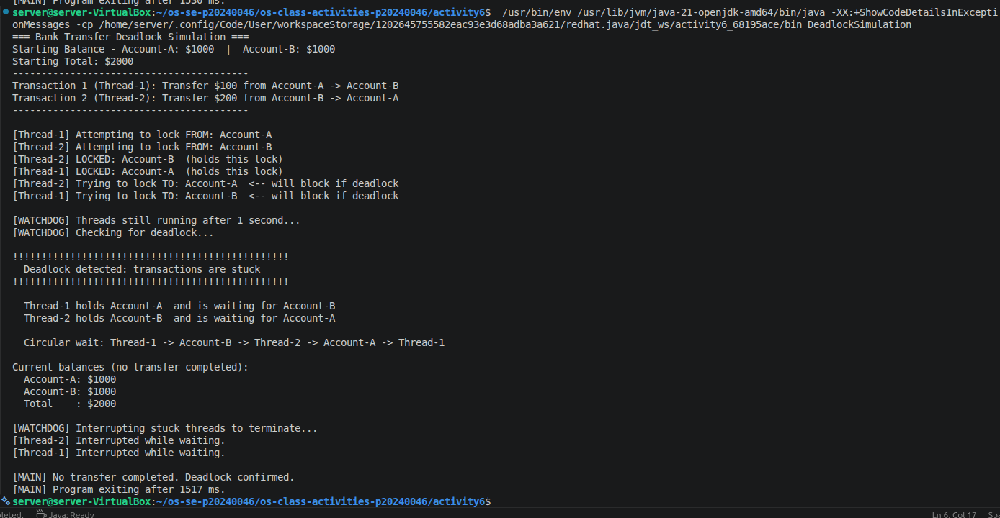
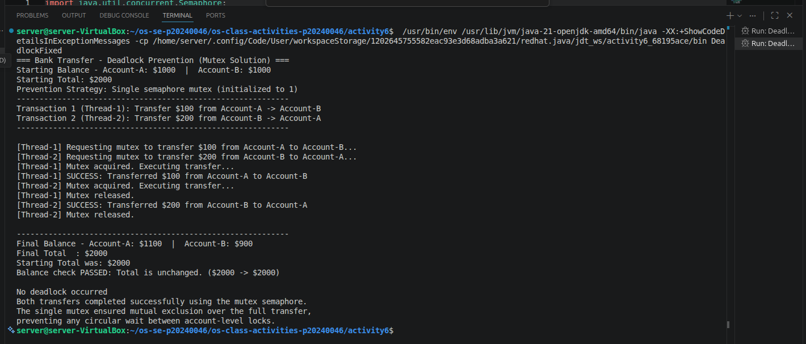

# Class Activity 6 - Deadlock Simulation

- **Student Name:** [Song Phengroth]
- **Student ID:** [p20240046]
- **Programming Language Used:** Java

---

## How to Run

```bash
# Compile and run Task 1
cd activity6
javac task1_deadlock/DeadlockSimulation.java
java -cp task1_deadlock DeadlockSimulation

# Compile and run Task 2
javac task2_prevention/DeadlockFixed.java
java -cp task2_prevention DeadlockFixed
```

---

## Task 1: Deadlock Version



- **Shared resources:** Account-A and Account-B (each with a `Semaphore lock`)
- **Transaction 1 (Thread-1):** Transfer $100 from Account-A → Account-B
- **Transaction 2 (Thread-2):** Transfer $200 from Account-B → Account-A
- **Deadlock message shown:** `Deadlock detected: transactions are stuck`
- **Explanation of why the program got stuck:**
  Thread-1 acquires the lock on Account-A, then sleeps. At the same time Thread-2
  acquires the lock on Account-B. When Thread-1 wakes up it tries to lock Account-B
  (already held by Thread-2). Thread-2 tries to lock Account-A (already held by
  Thread-1). Neither can proceed — this is a circular wait. The watchdog thread
  detects both threads are still alive and both are blocked on a second lock, then
  prints the deadlock message and interrupts the stuck threads.

---

## Task 2: Deadlock Prevention Version



- **Prevention strategy used:** Single shared `Semaphore mutex` (initialized to 1)
  wrapping the entire transfer operation.
- **Semaphore mutex initial value:** 1
- **Starting total:** $2000
- **Final total:** $2000
- **Did both transfers complete?** Yes
- **Why no deadlock occurred:**
  Because there is only one mutex for the whole transfer, only one thread can
  enter the critical section at a time. Thread-1 acquires `mutex`, completes its
  full transfer (locks nothing else), then releases `mutex`. Thread-2 then acquires
  `mutex` and completes its transfer. There are no per-account locks remaining, so
  circular wait is impossible.

---

## Questions

**1. What are the two shared resources in your bank transaction simulation?**

Account-A and Account-B. Both are accessed concurrently by two threads and each
has its own semaphore lock that threads must acquire before modifying the balance.

**2. Which line or section of your Task 1 program creates hold-and-wait?**

```java
from.lock.acquire();          // Thread holds the source-account lock...
Thread.sleep(150);            // ...while waiting here...
to.lock.acquire();            // ...then tries to acquire a second lock it doesn't have yet.
```

After `from.lock.acquire()` the thread holds one lock and then blocks on
`to.lock.acquire()` — it holds a resource while waiting for another. That is
hold-and-wait.

**3. How does Task 1 create circular wait?**

Thread-1 holds Account-A and waits for Account-B.
Thread-2 holds Account-B and waits for Account-A.

This forms a cycle: T1 → Account-B → T2 → Account-A → T1.
Neither thread will ever be granted its second lock because the only thread that
could release it is the one also stuck waiting.

**4. Why does the Task 1 program need a watchdog or timeout?**

Without a watchdog the program would hang silently forever. Java threads blocked
on `Semaphore.acquire()` do not time out automatically. A watchdog running on a
separate daemon thread can check, after a grace period, whether both transfer
threads are still alive and both are recorded as waiting for a second lock. If so,
it prints the required deadlock message and interrupts the stuck threads so the
program can exit.

**5. How does the single semaphore mutex prevent deadlock in Task 2?**

The mutex ensures mutual exclusion over the *entire* transfer operation — not just
one account. Before touching any balance a thread must acquire `mutex`. While it
holds `mutex` it performs the complete transfer and then releases `mutex`. Because
only one thread can be inside the critical section at a time, no thread ever holds
one resource while waiting for another. The hold-and-wait condition is broken,
which prevents deadlock.

**6. Which of the four deadlock conditions does your Task 2 solution remove or avoid?**

| Condition | Task 1 | Task 2 |
|---|---|---|
| Mutual Exclusion | Present (each account has its own lock) | Still present for the mutex itself, but there is only one lock total |
| Hold-and-Wait | **Present** — thread holds source lock while waiting for destination lock | **Eliminated** — thread acquires the single mutex and holds *nothing else* while waiting |
| No Preemption | Present | Present (mutex cannot be forcibly taken) |
| Circular Wait | **Present** — T1 waits for B, T2 waits for A | **Eliminated** — with only one lock there is no cycle possible |

Task 2 primarily eliminates **hold-and-wait** and **circular wait** by replacing
two per-account locks with a single global mutex.

**7. Why must the final total bank balance remain unchanged after both transfers?**

A bank transfer moves money between accounts; it does not create or destroy money.
If Thread-1 transfers $100 from A to B then A loses $100 and B gains $100 — net
change is zero. The same holds for Thread-2's $200 transfer in the other direction.
Regardless of the order in which the transfers complete, the sum of all account
balances must equal the starting total ($2000). Any deviation would indicate a
race condition, a bug in the critical section, or money being double-counted, which
is a serious correctness error in financial software.

---

## Reflection

This activity made concrete something that is easy to understand in theory but
surprisingly tricky to reproduce reliably: deadlock really does happen silently,
without any error message, unless you deliberately instrument your code to detect
it. The watchdog pattern — a separate monitoring thread that checks progress after
a timeout — is exactly what real systems like database lock managers and
distributed transaction coordinators use to detect and break deadlocks.

The single-mutex fix is elegantly simple: replacing two fine-grained locks with
one coarse-grained lock eliminates the circular-wait and hold-and-wait conditions
at the cost of some concurrency (only one transfer at a time). In a real high-volume
banking system this trade-off would be unacceptable and you would use lock ordering
(always acquire locks in a canonical order, e.g. by account ID) or optimistic
concurrency control instead. But for demonstrating the concept the mutex solution
is correct, easy to verify, and hard to get wrong.