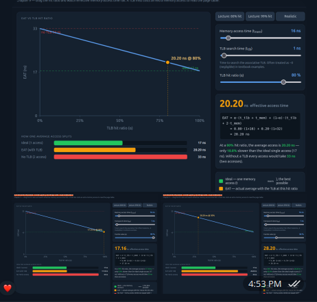
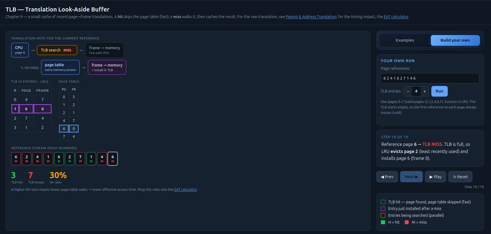
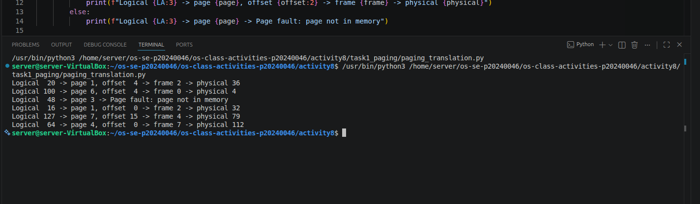
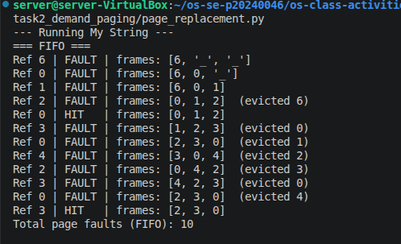
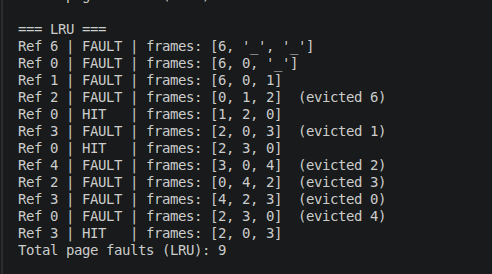

# Class Activity 8 - Memory Management & Virtual Memory

- **Student Name:** [Song Phengroth]   **Student ID:** [p20240046]
- **Personalization:** a = [6], b = 4 → N = (10*6+4) mod 128 = [64]
- **Programming Language Used:** [Python]

## Part 1A — Address translation (by hand)
[| Logical (LA) | page = LA/16 | offset = LA%16 | valid? | frame | physical = frame * 16 + offset |
|---|---|---|---|---|---|
| 20  | 1 | 4  | Yes | 2 | 2 * 16 + 4 = 36 |
| 100 | 6 | 4  | Yes | 0 | 0 * 16 + 4 = 4  |
| 48  | 3 | 0  | No  | – | – |
| 16  | 1 | 0  | Yes | 2 | 2 * 16 + 0 = 32 |
| 127 | 7 | 15 | Yes | 4 | 4 * 16 + 15 = 79 |
| N = 64 | 4 | 0  | Yes | 7 | 7 * 16 + 0 = 112 |]
1. Offset unchanged because: logical pages and physical frames are exactly the same size. Paging moves the entire block as a unit, so a byte's relative position within that block.
2. Largest offset = 16 byte page is 15 , bits = 4
3. (60 + a) = 66 bytes → 4.125 pages, internal fragmentation = 14 bytes (show working)

## Part 1B — TLB & Effective Access Time (by hand)
- My page-reference stream: 6 2 4 1 6 2 7 1 4 6    Prediction (expected hits): I expect around 3 hits because the TLB is small (4 entries) and the stream cycles through 6 unique pages, causing frequent evictions.
[| Ref (page) | HIT / MISS | Page table read? | TLB after (LRU→MRU) | Evicted |
|------------|------------|------------------|---------------------|---------|
| 6 | MISS | Yes | [6] | None |
| 2 | MISS | Yes | [6, 2] | None |
| 4 | MISS | Yes | [6, 2, 4] | None |
| 1 | MISS | Yes | [6, 2, 4, 1] | None |
| 6 | HIT  | No  | [2, 4, 1, 6] | None |
| 2 | HIT  | No  | [4, 1, 6, 2] | None |
| 7 | MISS | Yes | [1, 6, 2, 7] | 4 |
| 1 | HIT  | No  | [6, 2, 7, 1] | None |
| 4 | MISS | Yes | [2, 7, 1, 4] | 6 |
| 6 | MISS | Yes | [7, 1, 4, 6] | 2 |] → measured hits = 3/10, α = 0.3
- EAT at my α: 28.2 ns   |   EAT at 80% = 20.2ns |   99% = 17.16ns |   no TLB = 33ns (show substitutions)
- Why 99% beats no-TLB by 48%: It almost entirely eliminates the heavy latency penalty of reading the page table from memory for every single instruction, cutting the access time nearly in half.
   

## Part 1C — Paging simulator verification

- Did the simulator match my 1A table? Yes, the simulator accurately output the same page, offset, frame, and physical addresses, and correctly identified page 3 as a page fault.
- (Optional) Did the TLB sim reproduce my 1B hit ratio / EAT? …

## Part 2A — Page replacement (by hand)
- My reference string: 6 0 1 2 0 3 0 4 2 3 0 3    Prediction (FIFO vs LRU): FIFO will fault more than LRU because LRU will capitalize on the frequent re-referencing of pages 0 and 3 to refresh their recency.
[| Ref | H/F | F1 | F2 | F3 | Evicted |
|-----|-----|----|----|----|---------|
| 6   | F   | 6  | -  | -  | None    |
| 0   | F   | 6  | 0  | -  | None    |
| 1   | F   | 6  | 0  | 1  | None    |
| 2   | F   | 2  | 0  | 1  | 6       |
| 0   | H   | 2  | 0  | 1  | None    |
| 3   | F   | 2  | 3  | 1  | 0       |
| 0   | F   | 2  | 3  | 0  | 1       |
| 4   | F   | 4  | 3  | 0  | 2       |
| 2   | F   | 4  | 2  | 0  | 3       |
| 3   | F   | 4  | 2  | 3  | 0       |
| 0   | F   | 0  | 2  | 3  | 4       |
| 3   | H   | 0  | 2  | 3  | None    |] → FIFO faults: 10
[LRU trace table]
| Ref | H/F | F1 | F2 | F3 | Evicted |
|-----|-----|----|----|----|---------|
| 6   | F   | 6  | -  | -  | None    |
| 0   | F   | 6  | 0  | -  | None    |
| 1   | F   | 6  | 0  | 1  | None    |
| 2   | F   | 2  | 0  | 1  | 6       |
| 0   | H   | 2  | 0  | 1  | None    |
| 3   | F   | 2  | 0  | 3  | 1       |
| 0   | H   | 2  | 0  | 3  | None    |
| 4   | F   | 4  | 0  | 3  | 2       |
| 2   | F   | 4  | 0  | 2  | 3       |
| 3   | F   | 4  | 3  | 2  | 0       |
| 0   | F   | 0  | 3  | 2  | 4       |
| 3   | H   | 0  | 3  | 2  | None    |  → LRU faults: 9
Which faulted more, and did it match my prediction: FIFO faulted more (10 vs 9), which matched my prediction perfectly.

## Part 2B — Demand-paging simulator verification
   
- Did the simulator's counts for my 2A string match my hand totals? … (if not, what was wrong)

## Part 3 — Applied reasoning
1. Paging removes external fragmentation because memory is divided into fixed-size frames. The OS maps any available logical page to any free physical frame, regardless of where it is physically located, ensuring no scattered "holes" of unusable memory accumulate.
2. Loading a page into an empty frame still counts as a page fault because the hardware definition of a fault is simply an interrupt triggered when the valid bit for a requested page is 0. The CPU doesn't know why it's invalid until the OS traps the error and handles it.
3. At an 80% hit ratio, 20% of operations still incur the massive performance penalty of accessing main memory twice. Pushing the hit ratio to 99% nearly eliminates this double-access latency, bridging the gap between actual memory performance and the theoretical maximum speed of the cache.
4. LRU and FIFO diverged precisely at the 6th reference (Page 3). Because Page 0 was referenced during a hit on step 5, LRU refreshed its recency status, protecting it. FIFO ignored the hit and evicted Page 0 on step 6 simply because it was the oldest page currently sitting in memory.
5. Thrashing happens when the working set of active pages exceeds the available frames, causing the OS to spend all its time rapidly swapping pages in and out. With 1 frame, the fault rate jumps to nearly 100%, and the TLB hit ratio drops to 0%, bringing the system to a crawl.
6. **Benefit:** It allows programs to start immediately and drastically reduces overall memory usage since rarely-used functions or error-handling code are never loaded. **Risk:** It introduces ongoing runtime latency; as the program hits new sections of code, it will continuously stall to handle page faults, making performance unpredictable.