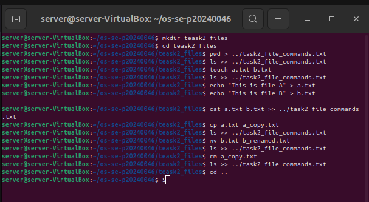
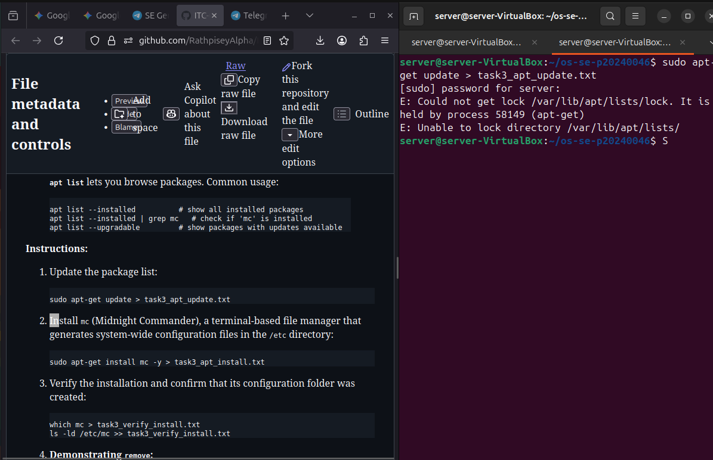
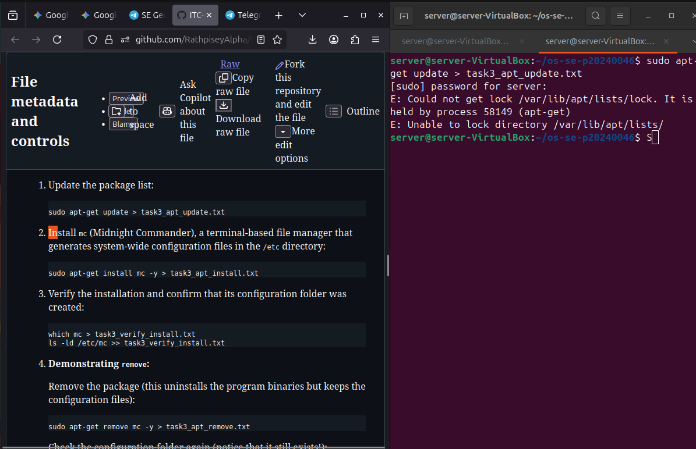
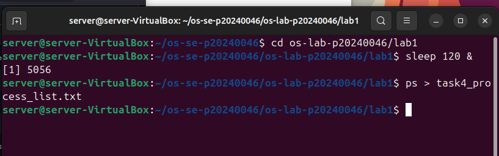
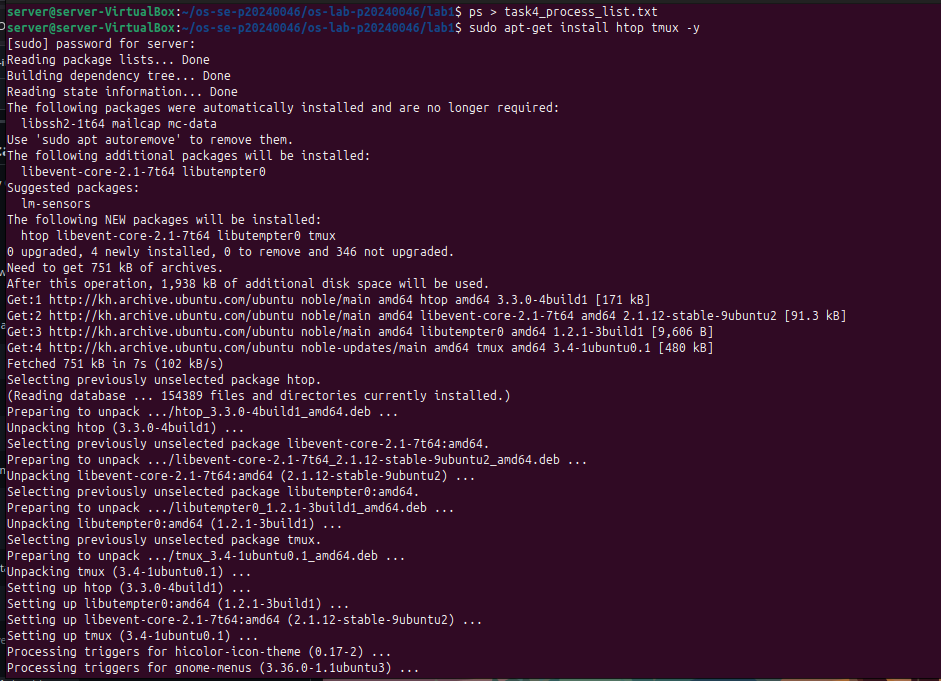
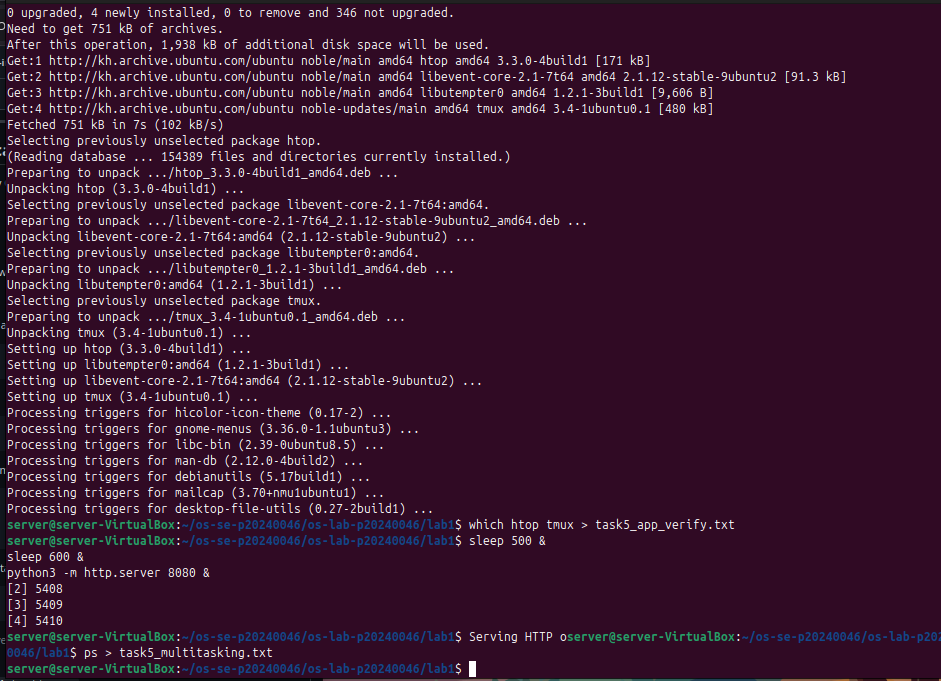

# OS Lab 1 Submission

- **Student Name:** Song Phengroth
- **Student ID:** P20240046

---

## Task 1: Operating System Identification

Briefly describe what you observed about your OS and Kernel here.

<!-- Insert your screenshot for Task 1 below: -->
Answer: 
I used the commands uname -a and lsb_release -a in the terminal to identify the operating system and kernel details. The output showed that my system is running Ubuntu Linux, along with the specific kernel version currently installed.

The uname -a command provided information about the Linux kernel version, architecture, and system build, while lsb_release -a displayed the Ubuntu distribution information, including the release version and codename.

These commands are useful for quickly determining system configuration and verifying the OS environment.
<!-- SCREENSHOT REQUIREMENT: Show the terminal after running uname -a and lsb_release -a, or the contents of your task1_os_info.txt file. -->

---

## Task 2: Essential Linux File and Directory Commands

Briefly describe your experience creating, moving, and deleting files.

Answer: 
In this task, I practiced using several fundamental Linux file management commands.

I used mkdir to create a new directory and touch to create files inside it. The cp command allowed me to copy files, while mv was used to move or rename files and directories. Finally, I used rm to delete files that were no longer needed.

This exercise demonstrated how Linux provides powerful command-line tools for efficiently managing files and directories within the filesystem.

<!-- SCREENSHOT REQUIREMENT: Show the terminal running the file manipulation commands (mkdir, touch, cp, mv, rm) or the final cat of your task2_file_commands.txt file. -->

---

## Task 3: Package Management Using APT

Explain the difference you observed between `remove` and `purge`.

Answer:
During this task, I observed the difference between the apt-get remove and apt-get purge commands.

The remove command uninstalls the application but keeps its configuration files stored in the system, usually inside directories such as /etc.

In contrast, the purge command completely removes the application including its configuration files. After running apt-get purge, the associated configuration directories (such as /etc/mc) were no longer present in the system.

<!-- Insert your screenshot for Task 3 below: -->
<!-- SCREENSHOT REQUIREMENT: Show the output of ls -ld /etc/mc after running apt-get remove (folder still exists) versus after running apt-get purge (folder is gone). -->

---

## Task 4: Programs vs Processes (Single Process)

Briefly describe how you ran a background process and found it in the process list.

Answer: 
To demonstrate the difference between a program and a process, I ran the command sleep 120 &.

The sleep program was executed in the background using the & symbol, which created a running process managed by the operating system.

I then used the ps command to display the list of active processes, where I was able to locate the running sleep process. This confirmed that when a program is executed, it becomes a process that the OS schedules and manages.

<!-- Insert your screenshot for Task 4 below: -->
<!-- SCREENSHOT REQUIREMENT: Show the terminal where you ran sleep 120 & and the subsequent ps output showing the sleep process running. -->

---

## Task 5: Installing Real Applications & Observing Multitasking

Briefly describe the multitasking environment and the background web server.

Answer: 
In this task, I installed htop tmux and ran applications while observing how Linux manages multiple processes simultaneously.

I ran a background process (sleep) and also started a simple Python web server using python3 -m http.server. Using the ps command, I could see both processes running at the same time.

This demonstrated Linux’s multitasking capability, where multiple processes can run concurrently and the operating system allocates CPU time and system resources among them.

<!-- Insert your screenshot for Task 5 below: -->
<!-- SCREENSHOT REQUIREMENT: Show the terminal ps output capturing the multiple background tasks (sleep and python3 server) running at the same time. -->

---

## Task 6: Virtualization and Hypervisor Detection

State whether your system is running on a virtual machine or physical hardware based on the command outputs.

Answer: 

To determine whether my system was running on a virtual machine or physical hardware, I used the commands systemd-detect-virt and lscpu.

The output indicated that the system is running on physical hardwaSe rather than a virtual machine. This is because my Ubuntu system is installed using a dual-boot configuration alongside another operating system, meaning it runs directly on the computer’s hardware instead of inside a hypervisor.

<!-- Insert your screenshot for Task 6 below: -->
<!-- SCREENSHOT REQUIREMENT: Show the terminal output of the systemd-detect-virt and lscpu commands. -->
