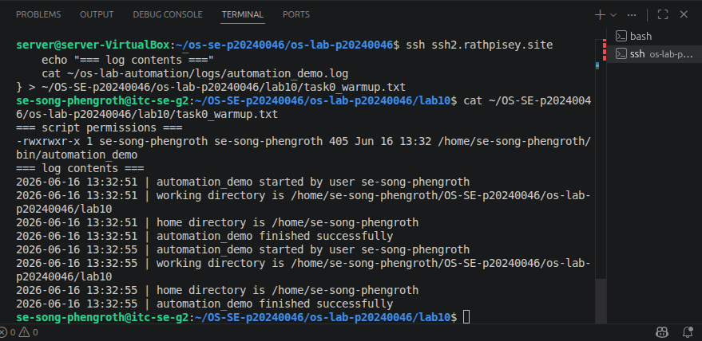
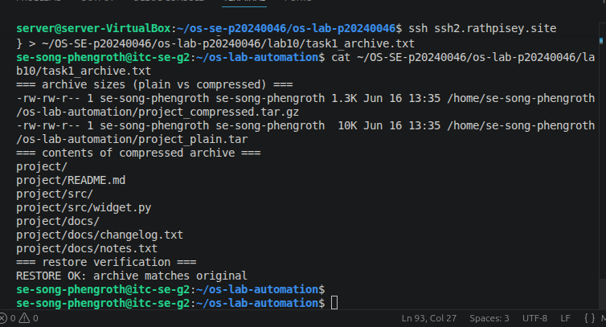
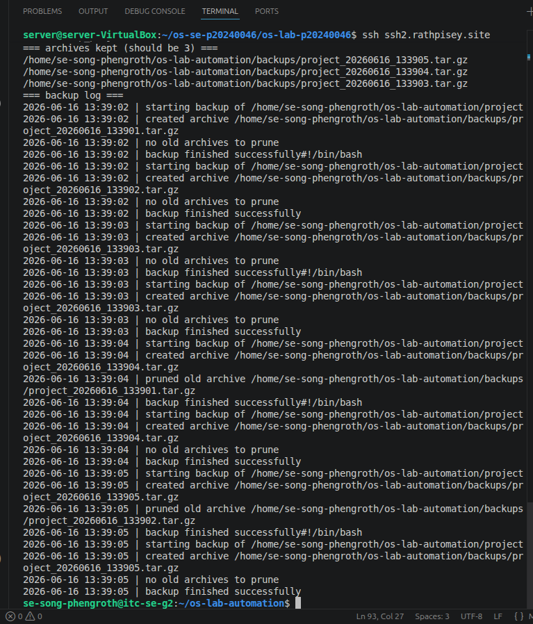
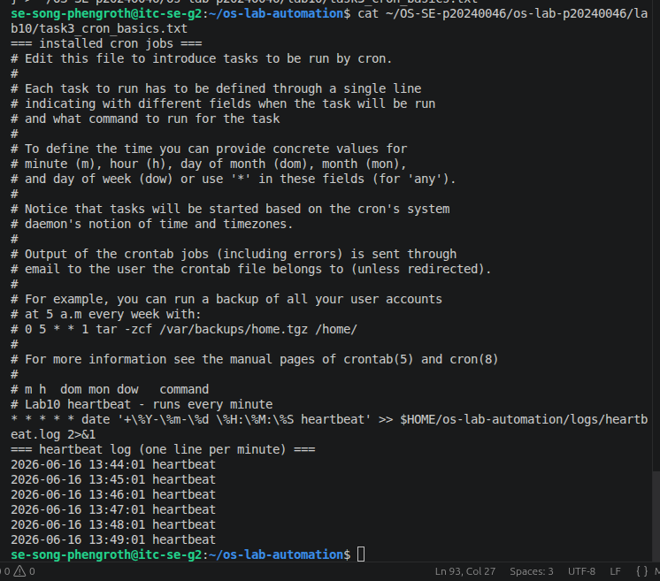
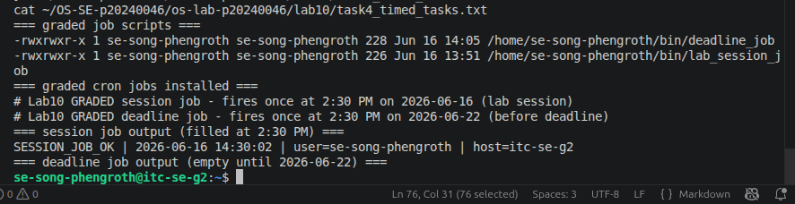
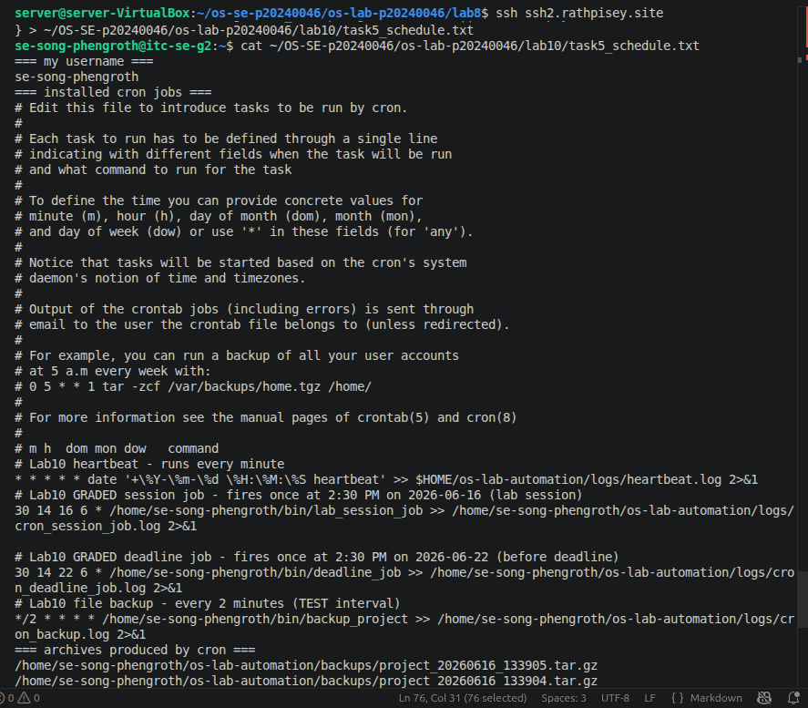
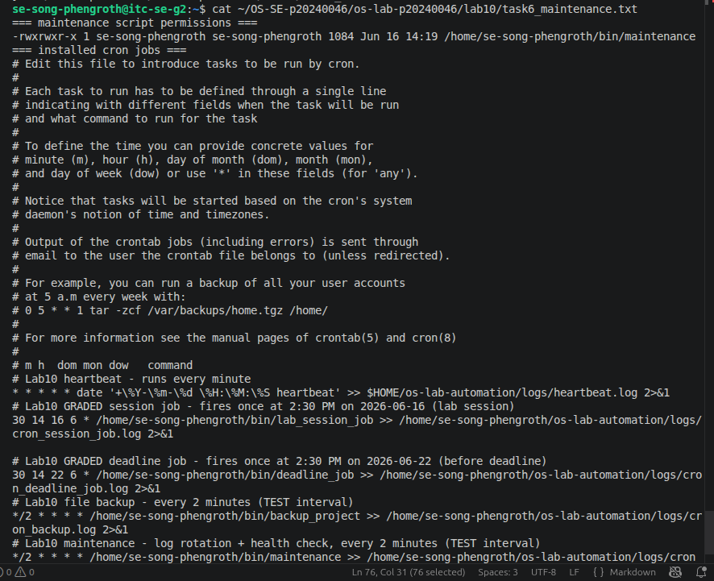
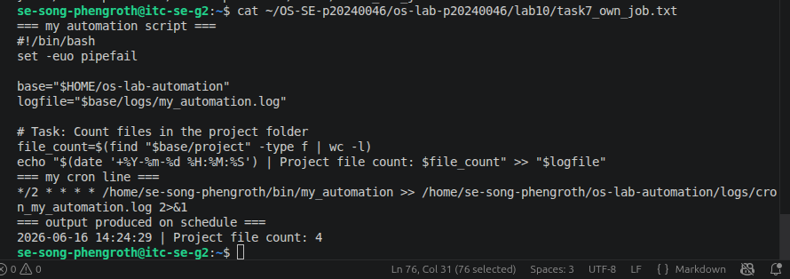
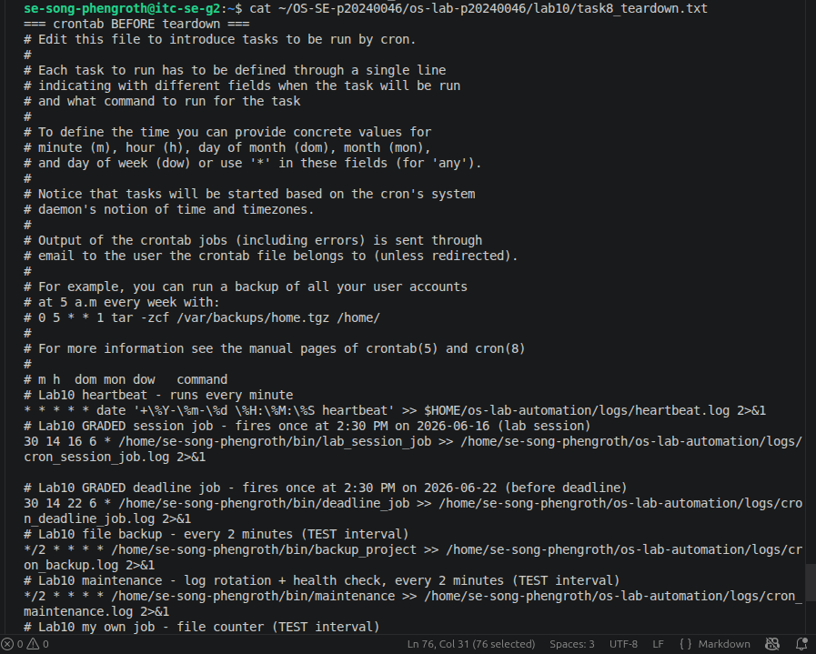

# OS Lab 10 - Backups, Archiving, Scheduling & cron Automation

> Rename this file to `README.md` inside your `lab10/` submission folder, then fill in every section.
> Replace each `` line so your screenshots actually display.
> Delete these quote-block instructions before submitting.

| | |
|---|---|
| **Student Name** |Song Phengroth|
| **Student ID** | <p20240046> |
| **Linux Username** | <se-song-phengroth> |
| **Date** | <2026-06-16> |

---

## Level 0 - Automation Warm-Up

What I did (1-2 sentences):

`I verified my automation_demo script had the correct execution permissions and successfully ran it to redirect its output into a log file.`

---

## Level 1 - Archiving & Compression

Size of `.tar` vs `.tar.gz` and why:

`The .tar file was larger because it only bundles files together without shrinking them. The .tar.gz file was significantly smaller because it applies gzip compression to reduce the overall byte size.`

---

## Level 2 - File & Folder Backup Script

How my retention keeps only the 3 newest archives:

`The script uses ls -1t to list all archives sorted by time (newest first). It then uses tail -n +4 to skip the first three newest files and passes the remaining older files to rm to be deleted.`

---

## Level 3 - Cron Fundamentals

My heartbeat cron line and what each field means:

`My heartbeat cron line and what each field means:
The schedule is * * * * *, which means the job runs every minute, of every hour, of every day of the month, of every month, on every day of the week.`

---

## Level 4 - Timed Graded Cron Tasks

The two graded schedules I installed:

| Job | Schedule | Fires at |
|-----|----------|----------|
| Session job | `30 14 16 6 *` | 2:30 PM 2026-06-16 |
| Deadline job | `30 14 22 6 *` | 2:30 PM 2026-06-22 |

Session job fired during the lab (`SESSION_JOB_OK` line in `session_job.out`):

Deadline job fired before the deadline (`DEADLINE_JOB_OK` line in `deadline_job.out`):

---

## Level 5 - Scheduling the Backup

Why the job needed the absolute path and output redirect:

`Cron executes in a limited, non-interactive environment that does not reliably expand the ~ shortcut. Absolute paths ensure the system finds the files, and the output redirect (>> logfile 2>&1) ensures both standard output and error messages are captured for debugging.`

---

## Level 6 - Maintenance Automation

What my maintenance job rotates and reports:

`My maintenance job compresses and archives old log files to prevent them from taking up too much disk space, and it appends system health metrics (like free disk space) to a health report.`

---

## Level 7 - Design Your Own Scheduled Job

**What my script does:** `My maintenance job compresses and archives old log files to prevent them from taking up too much disk space, and it appends system health metrics (like free disk space) to a health report.`

**Schedule I chose (and why):** `*/2 * * * * — I chose to run it every 2 minutes so I could quickly verify it was working and generating logs during the lab session.`

**What each of the five cron fields means in my line:** `* Minute: */2 (Every 2 minutes)`

---

## Level 8 - Teardown and Reset

How I removed the practice jobs while keeping the graded deadline job:

`I used a pipeline (crontab -l | grep GRADED | crontab -) to read my current crontab, filter out only the lines containing the word "GRADED", and write those specific lines back into the crontab, safely removing all testing jobs.`

---

## Lab Questions

1. **Archiving (`tar`) vs compression (`gzip`) - which shrinks bytes?**
   `Compression (gzip) shrinks the bytes. Archiving (tar) simply combines multiple files into a single file wrapper without reducing their size.`

2. **How much smaller was your `.tar.gz` than your `.tar`, and why?**
   `The .tar.gz was noticeably smaller because the gzip algorithm finds repeating data patterns within the files and compresses them, whereas the plain .tar is the full raw byte size of all the files combined.`

3. **Why did your cron jobs need an absolute path instead of `~/bin/...`?**
   `Cron runs in a minimal environment that does not load standard user profile variables. It often does not know what ~ refers to, so absolute paths are required to ensure the system can locate the exact file.`

4. **Why must `%` be escaped as `\%` in a crontab, and what does `>> logfile 2>&1` do?**
   `In a crontab, an unescaped % is interpreted as a newline character, which will break the command. >> logfile 2>&1 appends standard output (>>) to the logfile and redirects standard error (2) to standard output (&1), ensuring all errors are logged.`

5. **How does your `backup_project` retention decide what to delete, and why keep only N backups?**
   `It sorts the archives by time, skips the 3 most recent, and deletes the rest. Keeping only a fixed number of backups (N) prevents the hard drive from eventually filling up to 100% with old archive data.`

6. **Write the cron line that runs `/home/me/bin/deadline_job` once at 2:30 PM on 22 June. Which fields are filled in, which stay `*`?**
   `30 14 22 6 * /home/me/bin/deadline_job. Minute (30), Hour (14), Day (22), and Month (6) are filled in. Day of the Week stays * so it runs regardless of what day of the week June 22nd falls on.`

7. **In Level 8 teardown, why a filtered `crontab -` pipeline instead of `crontab -r`? What would `crontab -r` have broken?**
   `crontab -r removes the entire crontab completely. Doing this would have deleted the deadline_job required for grading, causing a failure for that portion of the lab.`

8. **Why is a scheduled health check with a threshold alert useful in real software engineering / operations?**
   `It allows systems to be monitored automatically, catching issues like running out of disk space or high CPU usage before they cause a system crash or an outage for end users.`

9. **Describe the job you wrote in Level 7: what it does, the schedule, and the meaning of each of its five cron fields.**
   `My job counts the number of files in my project directory and logs the count with a timestamp. It is scheduled with */2 * * * *. This means it runs every 2 minutes (*/2), every hour (*), every day of the month (*), every month (*), and every day of the week (*).`
