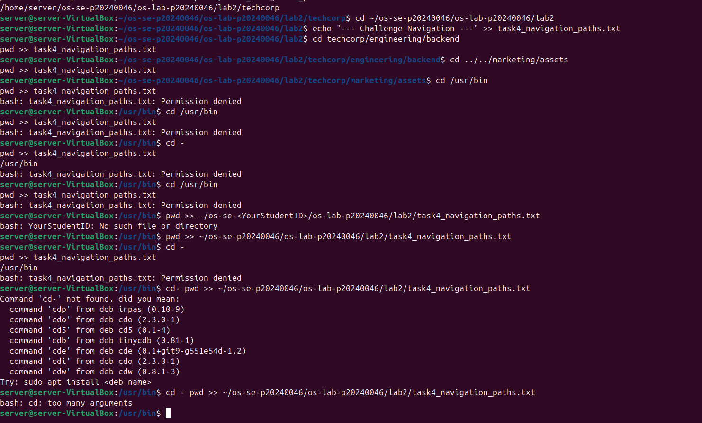
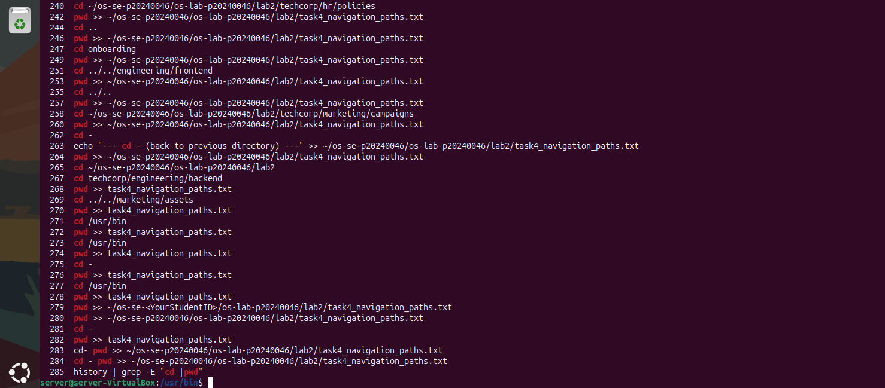
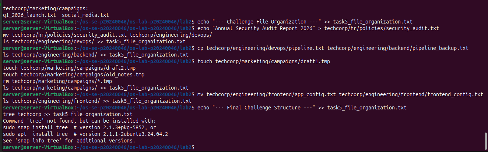
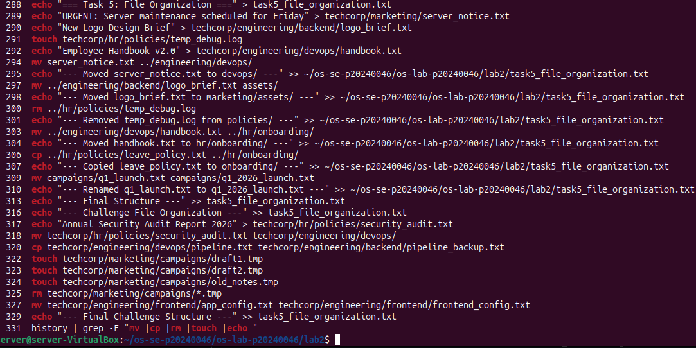
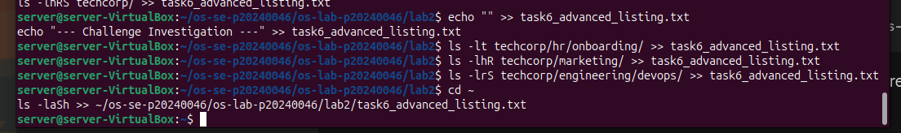
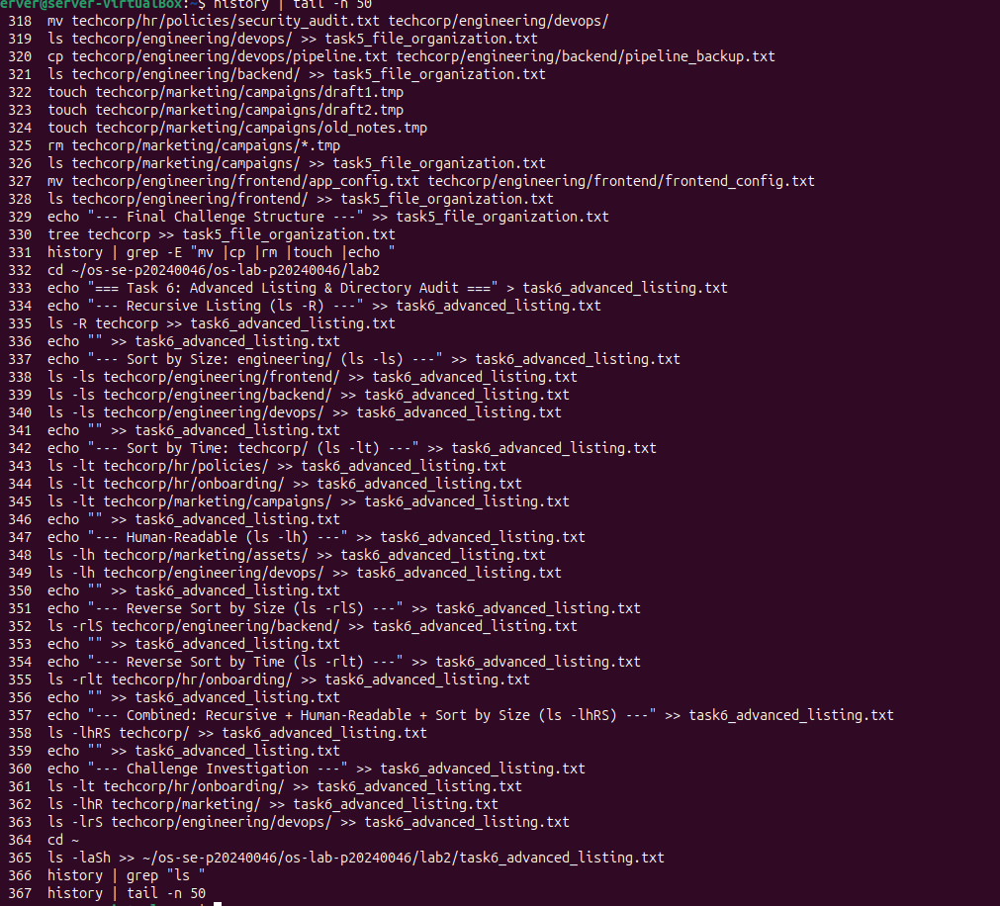

OS Lab 2 Submission

    Student Name: Song Phengroth
    Student ID: P20240046

Task Output Files

During the lab, each task redirected its output into .txt files. These files are your primary proof of work for the guided portions of each task. Make sure all of the following files are present in your lab2/ folder:

    task1_basic_navigation.txt
    task2_filesystem_exploration.txt
    task3_directory_structure.txt
    task4_navigation_paths.txt
    task5_file_organization.txt
    task6_advanced_listing.txt

Screenshots

The screenshots below focus on the Challenge sections and command history, since the guided task outputs are already captured in the .txt files above.
Screenshot 1 — Task 4 Challenge Commands

Show the terminal where you ran your own cd commands for challenges 8a–8e (navigating with relative paths, absolute paths, .., and cd -). This should show both the commands you typed and the pwd output after each navigation.

Screenshot 2 — Task 4 Challenge History

Run the following command and take a screenshot. This shows the navigation commands you used during the Task 4 challenge.

history | grep -E "cd |pwd"

Screenshot 3 — Task 5 Challenge Commands

Show the terminal where you ran your own mv, cp, rm, and rename commands for challenges 9a–9d (moving, copying, deleting, and renaming files). This should show both the commands you typed and the ls output confirming each action.

Screenshot 4 — Task 5 Challenge History

Run the following command and take a screenshot. This shows the file management commands you used during the Task 5 challenge.

history | grep -E "mv |cp |rm |touch |echo "

Screenshot 5 — Task 6 Challenge Commands

Show the terminal where you ran your own ls flag combinations for challenges 6a–6d (sorting by time, recursive human-readable listing, reverse size sort, and hidden files). This should show both the ls commands you chose and their output.

Screenshot 6 — Task 6 Challenge History

Run the following command and take a screenshot. This shows the ls commands you used during the Task 6 challenge.

history | grep "ls "

Screenshot 7 — Full Command History

Run the following command and take a screenshot. This shows the complete trail of commands you executed during the entire lab session.

history | tail -n 50

alt text