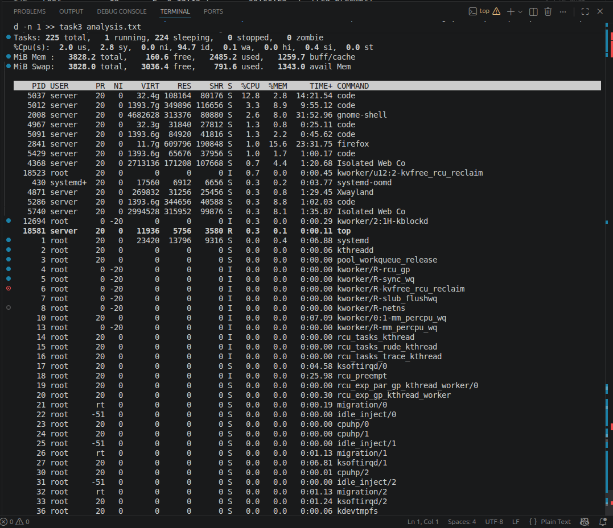
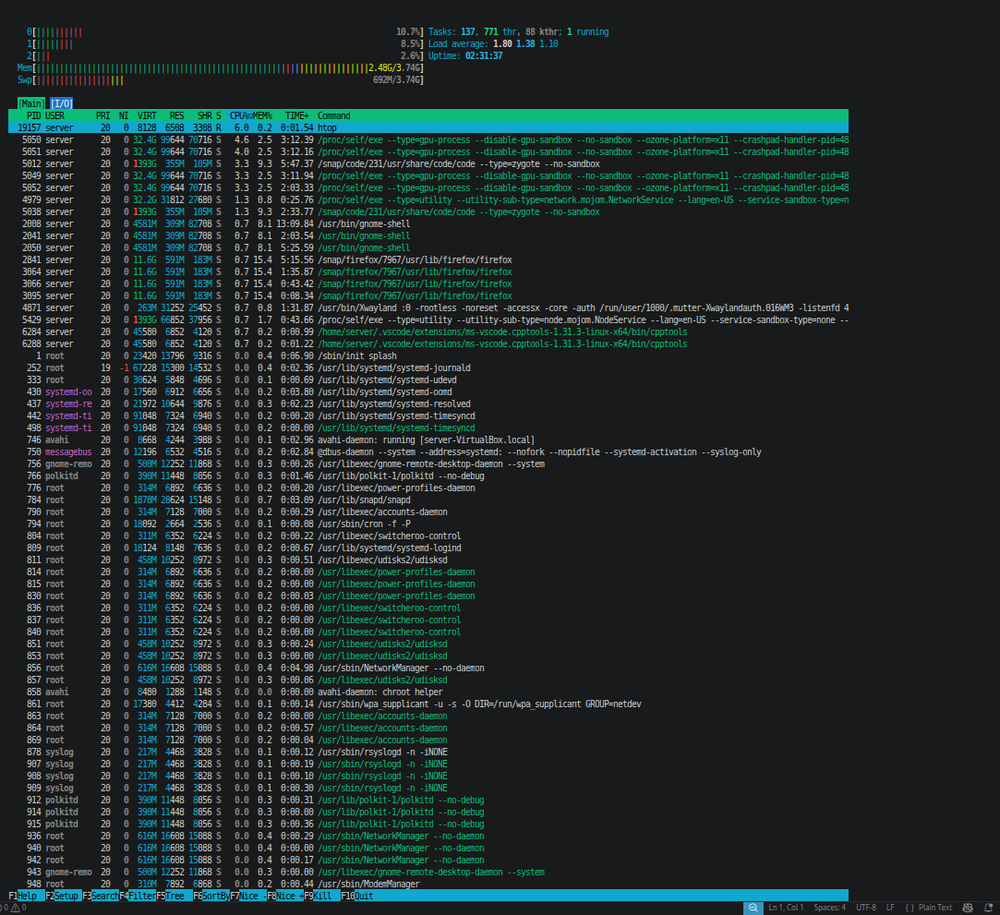
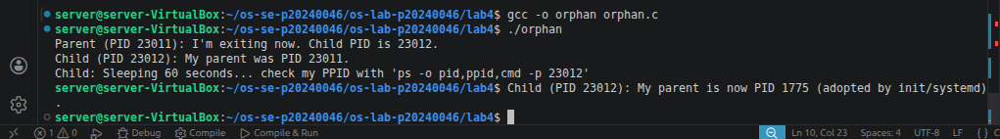
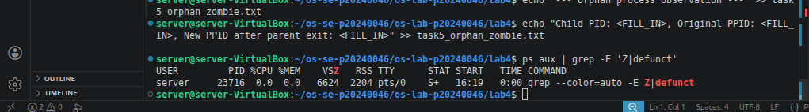

# Lab 4 — I/O Redirection, Pipelines & Process Management

| | |
|---|---|
| **Student Name** | `Song Phengroth` |
| **Student ID** | `p20240046` |

## Task Completion

| Task | Output File | Status |
|------|-----------|--------|
| Task 1: I/O Redirection | `task1_redirection.txt` | ✅  |
| Task 2: Pipelines & Filters | `task2_pipelines.txt` | ✅ |
| Task 3: Data Analysis | `task3_analysis.txt` | ✅ |
| Task 4: Process Management | `task4_processes.txt` | ✅ |
| Task 5: Orphan & Zombie | `task5_orphan_zombie.txt` | ✅ |

## Screenshots

### Task 4 — `top` Output

### Task 4 — `htop` Tree View

### Task 5 — Orphan Process (`ps` showing PPID = 1)

### Task 5 — Zombie Process (`ps` showing state Z)

## Answers to Task 5 Questions

1. **How are orphans cleaned up?**S
   > When a process becomes an orphan (because its parent process terminates before it does), it is automatically adopted by the init process (or systemd on modern systems, which is always PID 1). The init process periodically calls the wait() system call to collect the exit statuses of its adopted children as they finish executing, effectively cleaning them up from the system and preventing them from becoming zombies.

2. **How are zombies cleaned up?**
   > A zombie process is cleaned up when its parent process finally reads its exit status by calling the wait() or waitpid() system call. Once the parent reads this status, the operating system removes the zombie's entry from the process table. If the parent process is stuck or poorly written and never calls wait(), you can clean up the zombie by killing the parent process. This orphans the zombie, causing it to be adopted by init (PID 1), which will immediately clean it up.

3. **Can you kill a zombie with `kill -9`? Why or why not?**
   > No. You cannot kill a zombie process with kill -9
   >A zombie process is already "dead." It has entirely finished executing its code and released its system resources (memory, CPU). The only thing left is a tiny entry in the system's process table waiting for the parent to read its exit code. Since the process is no longer active, it cannot receive or act upon any signals, including SIGKILL. You cannot kill something that is already dead.

## Reflection

> _What was the most useful command/technique you learned in this lab? How would you use pipelines and redirection in a real server environment?_
>The most useful technique I learned in this lab was chaining commands together using pipes (|), particularly combining grep, cut, and awk. Instead of manually reading through massive log files, I can now parse thousands of lines instantly to find exactly what I need (like specific IP addresses or error codes). I would use this in a real-world scenario to quickly audit server security logs or troubleshoot web server crashes.