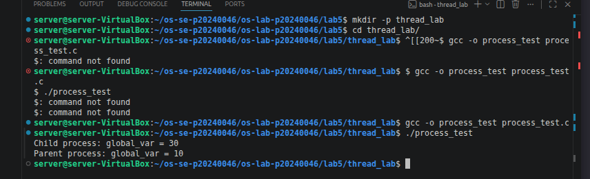
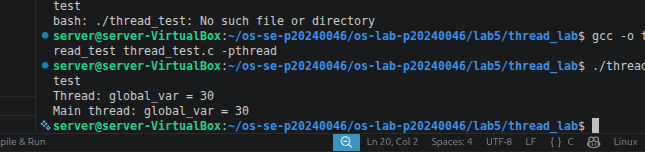
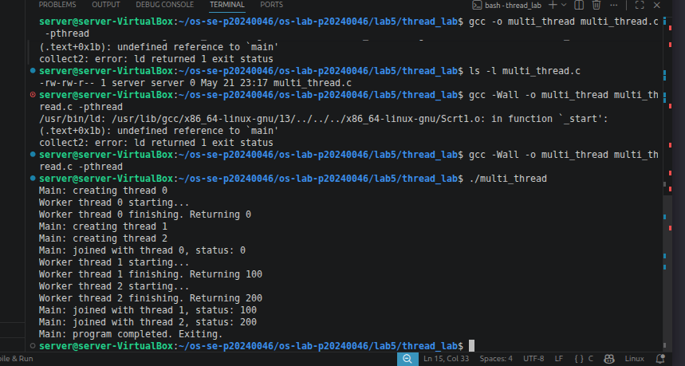
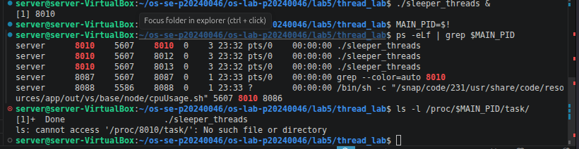
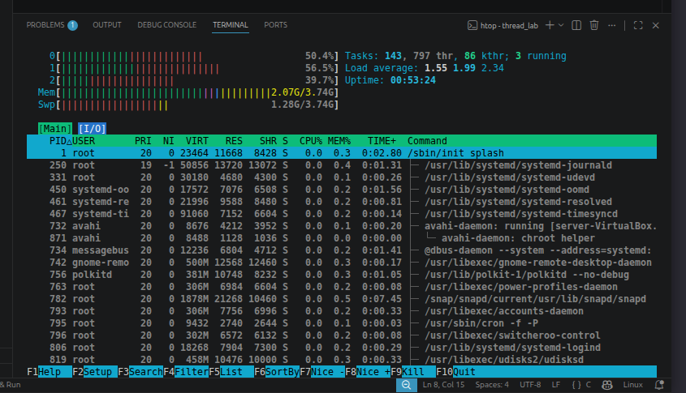
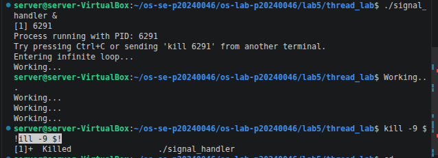
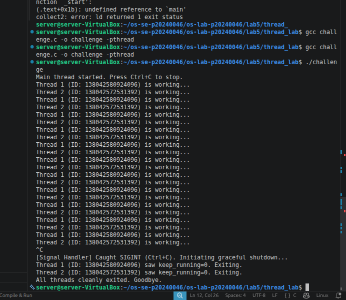

# OS Lab 5 Submission — Threads, Kernel Workers & Process Signals

- **Student Name:** Song Phengroth
- **Student ID:** p20240046

---

## Task Output Source Files

Make sure all of the following files are present in your `lab5/thread_lab/` folder:

- [ ] `process_test.c`
- [ ] `thread_test.c`
- [ ] `multi_thread.c`
- [ ] `sleeper_threads.c`
- [ ] `signal_handler.c`
- [ ] `challenge.c`

---

## Screenshots

Insert your screenshots below.

### Screenshot 1 — Task 1: Process vs Thread (Process Test)
Show the output of `process_test.c`.
<!-- Insert your screenshot below: -->

---

### Screenshot 2 — Task 1: Process vs Thread (Thread Test)
Show the output of `thread_test.c`.
<!-- Insert your screenshot below: -->

---

### Screenshot 3 — Task 2: Thread Interaction
Show the output of `multi_thread.c`.
<!-- Insert your screenshot below: -->

---

### Screenshot 4 — Task 3: Visualizing 1:1 Thread Mapping
Show the `ps -eLf` output or `/proc/[pid]/task/` directory visualizing the LWP mapping for user threads.
<!-- Insert your screenshot below: -->

---

### Screenshot 5 — Task 3: `htop` Kernel Threads
Show `htop` visualizing kernel threads (usually bracketed names like `[kworker]`).
<!-- Insert your screenshot below: -->

---

### Screenshot 6 — Task 4: Catching `SIGINT`
Show the output of your `signal_handler` program gracefully catching `Ctrl+C`.
<!-- Insert your screenshot below: -->

---

### Screenshot 7 — Challenge: Graceful Multithreaded Shutdown
Show the output of your `challenge.c` program joining its threads and exiting gracefully after receiving `Ctrl+C`.
<!-- Insert your screenshot below: -->

---

## Answers to Lab Questions

1. **Why do threads share memory while processes do not (by default)?**
   > Processes are designed to be independent and isolated execution environments. By default, the operating system assigns each process its own private virtual memory address space to ensure stability and security—so a crash or bug in one process doesn't corrupt another. Threads, on the other hand, are designed for concurrency within a single application. Because they exist within the same process, they inherently share that process's address space (including the code, data, and heap segments). This sharing is intentional; it allows threads to communicate and share data extremely quickly without the overhead of Inter-Process Communication (IPC) mechanisms. They only maintain their own separate stacks, registers, and program counters to keep track of their individual execution paths.
   

2. **Based on the 1:1 mapping, what is the role of an LWP (Lightweight Process) in Linux?**
   > In Linux's 1:1 threading model (specifically under the Native POSIX Thread Library, or NPTL), an LWP acts as the kernel-level schedulable entity that directly backs a single user-space thread.The Linux kernel does not differentiate between "processes" and "threads" in the traditional sense; it only sees schedulable execution contexts (LWPs). The role of the LWP is to be the unit of execution that the kernel's scheduler actually manages and allocates CPU time to. Because of this 1:1 mapping, if a user-space thread makes a blocking system call, only its corresponding LWP is blocked, allowing the kernel to continue scheduling the process's other LWPs (threads) on available CPU cores.

3. **Why is it restricted to send signals to kernel threads (e.g., `kthreadd` or `kworker`)?**
   > Kernel threads run exclusively in kernel space (Ring 0) and are responsible for critical, low-level operating system tasks such as memory management, block device flushing, and hardware interrupt handling.

> Allowing user-level signals to interrupt, pause, or kill these threads would severely compromise system stability and could easily lead to kernel panics, frozen hardware, or catastrophic data corruption. Additionally, signals are generally designed to be handled in user space; since kernel threads have no user-space context or memory mapping, they do not have the infrastructure to safely catch or process standard user-defined signal handlers.

4. **Why can't `SIGKILL` (kill -9) be caught by a signal handler?**
   > SIGKILL is explicitly designed as the ultimate failsafe mechanism for the operating system and system administrators.

---
