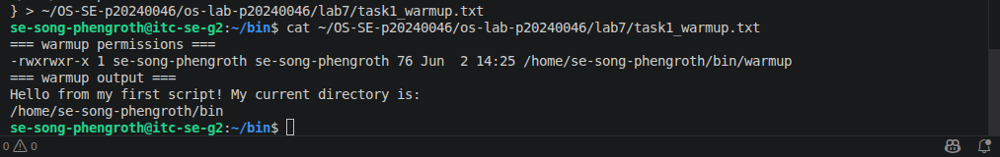
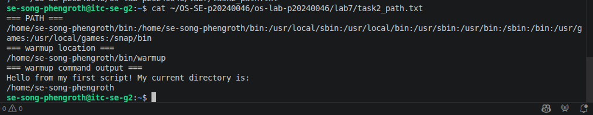
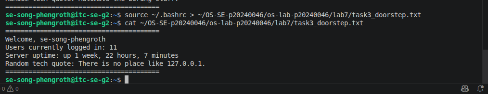
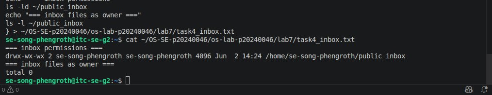
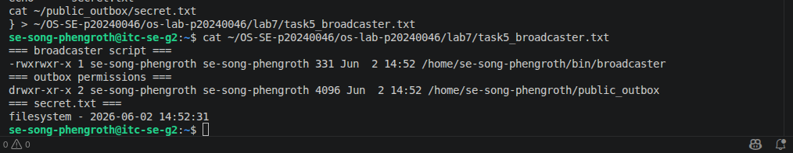
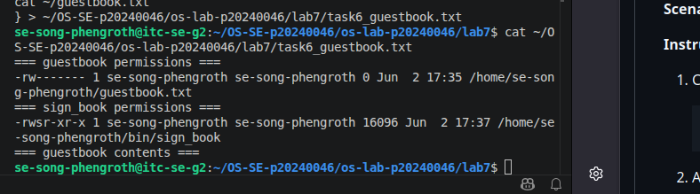
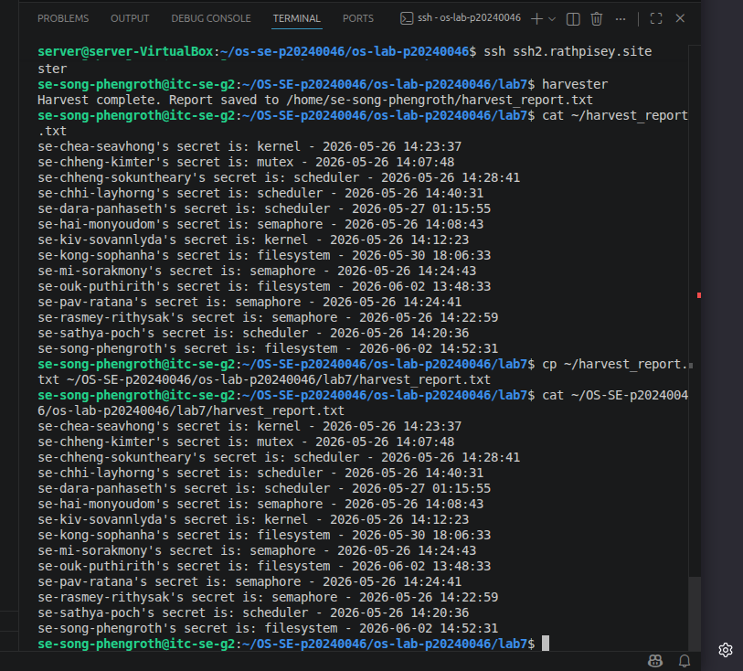
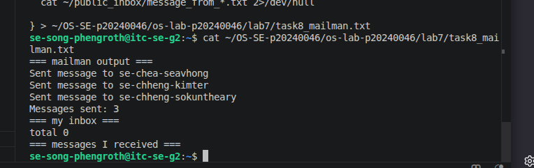

# OS Lab 7 Submission — Bash Scripting, Permissions & Server Automation

- **Student Name:** Song Phengroth
- **Student ID:** P20240046
---

## Task Output Files

Make sure all of the following files are present in your `lab7/` folder:

- [x] `task1_warmup.txt`
- [x] `task2_path.txt`
- [x] `task3_doorstep.txt`
- [x] `task4_inbox.txt`
- [x] `task5_broadcaster.txt`
- [x] `task6_guestbook.txt`
- [x] `harvest_report.txt`
- [x] `task8_mailman.txt`
- [x] `sign_book.c`
- [x] `scripts/warmup`
- [x] `scripts/broadcaster`
- [x] `scripts/harvester`
- [x] `scripts/mailman`
- [x] `scripts/sign_book_binary`

---

## Screenshots

Insert your screenshots below.

### Screenshot 1 — Task 1: Warm-Up Script
Show `cat task1_warmup.txt` with the executable `warmup` script and successful output.

---

### Screenshot 2 — Task 2: PATH Setup
Show `cat task2_path.txt` with your `PATH`, `which warmup`, and running `warmup` by name.

---

### Screenshot 3 — Task 3: Doorstep Message
Show `cat task3_doorstep.txt` with username, users online, uptime, and random quote.

---

### Screenshot 4 — Task 4: Secure Mailbox
Show `cat task4_inbox.txt` with `public_inbox` permissions and a test file from a classmate.

---

### Screenshot 5 — Task 5: Broadcaster
Show `cat task5_broadcaster.txt` with the broadcaster script evidence and `secret.txt`.

---

### Screenshot 6 — Task 6: VIP Guestbook
Show `cat task6_guestbook.txt` with guestbook permissions, SUID binary permissions, and guestbook contents.

---

### Screenshot 7 — Task 7: Data Harvester
Show `cat harvest_report.txt` containing secrets collected from classmates.

---

### Screenshot 8 — Task 8: Mailman Bot
Show `cat task8_mailman.txt` with mailman output and messages received in your inbox.

---

## Answers to Lab Questions

1. **Why did `warmup` fail before you added execute permission?**
   By default, newly created text files do not have execution privileges. When trying to run a script without the execute bit (x), the OS kernel denies execution rights, resulting in a Permission denied error. Adding chmod +x changes the file's metadata to let the shell interpreter execute the code within.

2. **What does adding `~/bin` to `PATH` allow you to do?**
   The $PATH environment variable tells Bash which directories to search through when evaluating a typed command. Adding ~/bin allows us to run custom scripts located inside that folder directly by typing their filenames (e.g., warmup) from any working directory on the system, removing the need to type relative or absolute paths like ~/bin/warmup.

3. **Why does `chmod 733 public_inbox` allow classmates to drop files but not list the inbox?**
   Permission 733 maps to rwx-wx-wx. For non-owners (Group and Others), it grants write (w) and execute (x) permissions but denies read (r).

Write (w) and Execute (x) allow classmates to navigate into the directory and write/create new files inside it.

No Read (r) prevents them from querying or listing the contents of the folder via ls, effectively keeping other students' filenames private.

4. **Why does Linux ignore SUID on shell scripts, and why did we use a compiled C program instead?**
   Linux ignores the SUID (Set User ID) bit on interpreted scripts due to major race-condition security vulnerabilities (such as symlink exploits where a malicious script can be swapped between verification and execution steps). To work around this safety feature, a compiled C program is used. Binary code is processed directly by the kernel via execve(), preventing path-hijacking exploits and safely allowing elevated permissions (like appending to a restricted VIP guestbook).

5. **What is the difference between `>` and `>>` in Bash redirection?**
   '>' is the overwrite operator; it empties out or creates a file from scratch, dropping any data previously held inside before writing the new output.

    '>>' is the append operator; it preserves existing content and writes the new data at the very end of the file.
6. **How did your `harvester` avoid reading files that were missing or not readable?**
   The script utilized conditional test flags before evaluating standard loops. It explicitly checked if a path existed and had read permissions using the -r conditional expression check [ -r "$file" ] within an if statement. If a target file didn't pass the check, the script safely skipped it, avoiding throwing cluttering shell errors.
7. **What permission problems did you or your classmates need to fix during the lab?**
   Common issues included accidental syntax errors when establishing target output files (such as typing an extra literal $ before running braced blocks), forgotten base directory paths, and missing execution access on the local home directory boundaries (~). Plainly executing chmod +x often leaves the Others bit unset on shared servers, requiring explicit target assignment like chmod o+x or chmod a+x so peers could actually traverse into subfolders.
---

## Reflection

> _What did this lab teach you about combining scripting, permissions, and automation on a shared Linux server?_
This lab provided a practical understanding of operating within shared Linux multi-user servers. Writing automation routines inside ~/.bashrc highlighted how custom workflows can dynamically fetch diagnostic server states like uptime and who. Managing granular folder bits (such as 733 blind drops and SUID binaries) emphasized the delicate operational balance between collaboration and security. It demonstrated that robust system administration isn't just about giving permissions away, but scaling minimal privileges to allow applications to interact securely without exposing sensitive user backends.