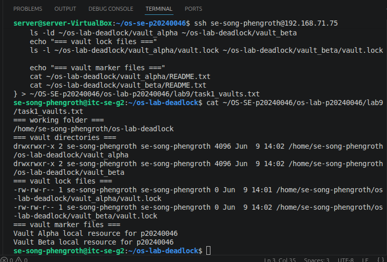
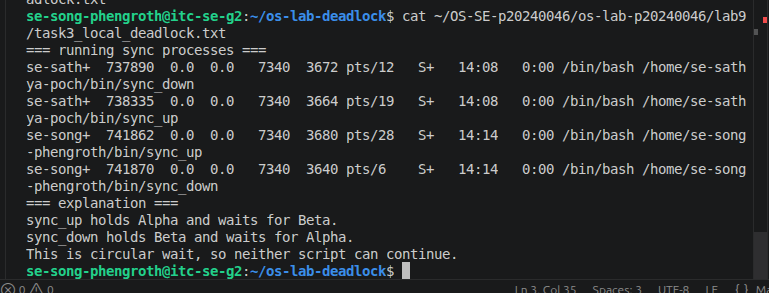
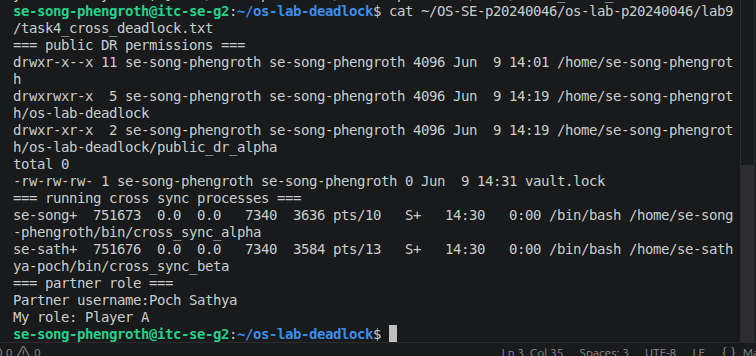
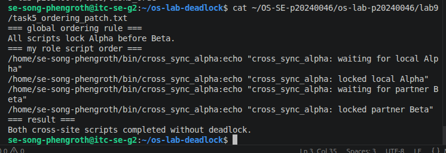
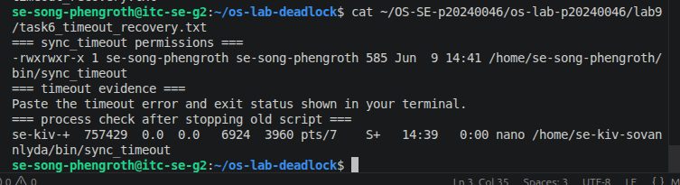
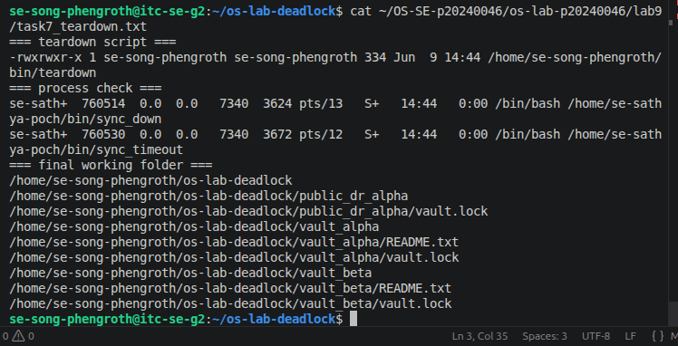

# OS Lab 9 Submission - The Quantum Vault Deadlock

- **Student Name:** Song Phengroth
- **Student ID:** P20240046
- **Linux Username:** se-song-phengroth
- **Partner Username:** Poch Sathya
- **My Role:** Player A 

---

## Required Working Files Outside the Repo

Confirm these files and folders existed while you ran the lab:

- [ ] `~/bin/sync_up`
- [ ] `~/bin/sync_down`
- [ ] `~/bin/sync_timeout`
- [ ] `~/bin/teardown`
- [ ] `~/bin/cross_sync_alpha` OR `~/bin/cross_sync_beta`
- [ ] `~/os-lab-deadlock/README.md`
- [ ] `~/os-lab-deadlock/vault_alpha/README.txt`
- [ ] `~/os-lab-deadlock/vault_alpha/vault.lock`
- [ ] `~/os-lab-deadlock/vault_beta/README.txt`
- [ ] `~/os-lab-deadlock/vault_beta/vault.lock`
- [ ] `~/os-lab-deadlock/public_dr_alpha/vault.lock` OR `~/os-lab-deadlock/public_dr_beta/vault.lock`

---

## Task Output Files

Make sure all of the following files are present in your `lab9/` folder:

- [ ] `task1_vaults.txt`
- [ ] `task2_sync_scripts.txt`
- [ ] `task3_local_deadlock.txt`
- [ ] `task4_cross_deadlock.txt`
- [ ] `task5_ordering_patch.txt`
- [ ] `task6_timeout_recovery.txt`
- [ ] `task7_teardown.txt`
- [ ] `scripts/sync_up`
- [ ] `scripts/sync_down`
- [ ] `scripts/sync_timeout`
- [ ] `scripts/teardown`
- [ ] `scripts/cross_sync_alpha` OR `scripts/cross_sync_beta`

---

## Screenshots

Insert your screenshots below.

### Screenshot 1 - Level 1: Vault Workspace Setup
Show `vault_alpha`, `vault_beta`, and their `vault.lock` files.

---

### Screenshot 2 - Level 3: Local Deadlock
Show frozen `sync_up` and `sync_down` terminals or process evidence.

---

### Screenshot 3 - Level 4: Site-to-Site Deadlock
Show partner cross-site scripts frozen in circular wait.

---

### Screenshot 4 - Level 5: Global Resource Ordering Patch
Show ordered locking completing without deadlock.

---

### Screenshot 5 - Level 6: Timeout Recovery
Show the timeout error and nonzero exit status.

---

### Screenshot 6 - Level 7: Cleanup and Reset
Show the process check and final working tree.

---

## Deadlock Observation Table

| Level | Script A Held | Script A Waited For | Script B Held | Script B Waited For | Result |
|:----:|---------------|---------------------|---------------|---------------------|--------|
| 3 | vault_alpha.lock | vault_beta.lock | vault_beta.lock | vault_alpha.lock | Deadlock |
| 4 | Alpha site lock | Beta site lock | Beta site lock | Alpha site lock | Cross-site deadlock |
| 5 | Alpha lock then Beta lock | None (ordered access) | Waited for Alpha before acquiring Beta | None | No deadlock |

---

## Answers to Lab Questions

1. **What does each `vault.lock` file represent in this lab?**
   Each vault.lock file represents a shared resource that can only be accessed by one process at a time. The lock file is used with flock to provide mutual exclusion and prevent simultaneous access to the same vault
2. **Why does `flock` require every script to lock the same shared file to coordinate correctly?**
   lock works by placing locks on a specific file. If different scripts lock different files, they are not coordinating with each other. All processes must lock the same file so the operating system can enforce synchronization between them.
3. **In the local deadlock, which resource did `sync_up` hold, and which resource did it wait for?**
    ync_up held the vault_alpha.lock resource and waited for vault_beta.lock.

4. **In the local deadlock, which resource did `sync_down` hold, and which resource did it wait for?**
  sync_down held the vault_beta.lock resource and waited for vault_alpha.lock.

5. **Which four deadlock conditions were present in Level 3?**
   The four deadlock conditions were:

    Mutual Exclusion – only one process could hold a lock at a time.
    Hold and Wait – each process held one lock while waiting for another.
    No Preemption – locks could not be forcibly taken away.
    Circular Wait – each process waited for a resource held by the other.

6. **How does the global Alpha-before-Beta ordering rule break circular wait?**
   The Alpha-before-Beta rule forces every process to acquire locks in the same order. Since no process can acquire Beta before Alpha, a circular chain of waiting cannot form, eliminating the circular wait condition and preventing deadlock.

7. **Why is `flock -w` useful for recovery even though it does not prevent every deadlock?**
   flock -w sets a timeout on lock acquisition. If a process cannot obtain a lock within the specified time, it exits instead of waiting forever. This helps recover from deadlocks by preventing processes from becoming permanently stuck.

8. **Why should you check for stuck processes before finishing a deadlock lab?**
   Stuck processes may continue holding locks and consuming system resources. They can interfere with later tests, cause incorrect results, and prevent scripts from running correctly. Checking for and terminating lingering processes ensures a clean system state.

---

## Reflection

> _What did this lab teach you about shared resources, process synchronization, deadlock prevention, and deadlock recovery?_
This lab demonstrated how shared resources must be carefully synchronized when multiple processes access them concurrently. By using flock, I learned how operating systems implement mutual exclusion through locks. The lab showed how deadlocks occur when processes hold resources while waiting for others, creating a circular dependency. I observed all four deadlock conditions in practice and learned that preventing even one condition can eliminate deadlocks. Implementing a global resource ordering strategy prevented circular wait, while timeout-based locking provided a recovery mechanism when deadlocks occurred. Overall, the lab provided hands-on experience with process synchronization, deadlock prevention, detection, and recovery techniques used in real operating systems.